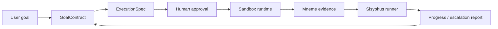

# Zeus

Zeus is a local-first, approval-gated goal-to-agent control plane inspired by
Hermes.

Its purpose is simple: understand a user's real goal, turn that goal into a
verifiable blueprint, and keep pushing toward the outcome only inside explicit
safety, evidence, and human-control boundaries.

Zeus is not designed to be a chat bot that sometimes runs tools. It is designed
to be a controlled execution system for AI work: intent becomes a contract,
plans become auditable specs, execution produces evidence, and blocked work is
reported honestly instead of being dressed up as success.

## Why Zeus

Modern AI agents often fail in two opposite ways:

- They stay conversational and avoid doing the work the user actually wanted.
- They execute too eagerly without enough control, evidence, or reversibility.

Zeus tries to sit in the useful middle.

- Conversation-first for light use cases.
- Blueprint-first before meaningful execution.
- Human approval before sandboxed action.
- Evidence before completion claims.
- Local-first memory, traces, skills, and artifacts.
- Explicit escalation when the system is blocked or outside policy.

## Core Loop



Two things anchor the loop:

- **GoalContract**: the user's intent externalized into deliverables,
  acceptance criteria, assumptions, constraints, and forbidden actions.
- **Mneme evidence**: observed runtime facts such as checkpoints, command
  outputs, diffs, verification records, and reports.

Everything else is orchestration around those two truth sources.

## Implemented

Zeus currently includes milestones 1-10 plus the first Hermes absorption pass:

- Isolated Python package and CLI: `zeus`.
- Private local state under `~/.zeus` or `ZEUS_HOME`.
- Pydantic schemas for goals, execution specs, approvals, traces, sandbox
  artifacts, evidence, skills, and registries.
- Blueprint mode that converts a goal into a plan-only `GoalContract` and
  `ExecutionSpec`.
- Human approval and rejection loop.
- Approval-gated local process sandbox with checkpoints, timeout budgets,
  scrubbed environment, command artifacts, redaction, and network/destructive
  command policy.
- Sisyphus runner that advances an approved run and escalates blocked work
  instead of pretending it is complete.
- Mneme evidence layer with checkpoint, command, diff, note, and verification
  records.
- Skill lifecycle: draft, test, promote, retire.
- Provider auth references, model routes, tool registry, and GitHub publishing
  preparation.
- Hermes-style guarded agent session: model-transport-neutral tool calls route
  through approval, sandbox, Mneme evidence, and local SQLite state.
- Content-addressed restorable checkpoints and restore reports.
- SQLite session/message/evidence/artifact index with local search.
- Large tool output artifact persistence with context previews.
- Background skill review that drafts candidates from repeated blocked evidence.
- Runtime backend slots for local process, Docker, SSH, Modal, Daytona,
  Singularity, and future microVM isolation.
- Plugin/MCP/tool-pack registry, cron-style schedule registry, gateway adapter
  registry, trajectory export, and local doctor report.

## Install

Zeus uses Python 3.11+.

```bash
uv sync --extra dev
uv run zeus --help
```

## Quickstart

```bash
uv run zeus init
uv run zeus blueprint "Create a marketing carousel automation workflow"
uv run zeus approve <run_id>
uv run zeus sandbox-snapshot <run_id>
uv run zeus sandbox-run <run_id> -- python -c "print('hello from Zeus')"
uv run zeus execute <run_id>
uv run zeus agent-run <run_id>
uv run zeus evidence <run_id>
```

## CLI Surface

Core:

- `zeus init`
- `zeus blueprint`
- `zeus approve`
- `zeus reject`
- `zeus status`
- `zeus runs`

Execution and evidence:

- `zeus sandbox-snapshot`
- `zeus sandbox-run`
- `zeus execute`
- `zeus pursue`
- `zeus mneme-diff`
- `zeus evidence`
- `zeus agent-run`
- `zeus sandbox-restore`
- `zeus memory-search`

Skills:

- `zeus skill-draft`
- `zeus skill-test`
- `zeus skill-promote`
- `zeus skill-retire`
- `zeus skills`

Registries:

- `zeus provider-add`
- `zeus providers`
- `zeus model-route-add`
- `zeus model-routes`
- `zeus tool-register`
- `zeus tools`
- `zeus github-prep`
- `zeus github-plans`

Hermes absorption:

- `zeus runtime-backends`
- `zeus plugin-register`
- `zeus plugins`
- `zeus cron-add`
- `zeus cron-jobs`
- `zeus gateway-register`
- `zeus gateways`
- `zeus trajectory-export`
- `zeus doctor`

## Safety Model

Zeus is local-first and local-only by default.

- No remote telemetry.
- No cloud sync by default.
- No execution before blueprint approval.
- No raw secret values in provider config.
- Secret-looking text is redacted before persistence where the runtime observes
  it.
- Local state is written under `~/.zeus` with restrictive permissions.
- Network access is deny-by-default in the current sandbox runtime.
- GitHub publishing prep never commits, pushes, or creates repositories by
  itself.

The current sandbox is a local process sandbox, not a microVM. It enforces
approval, path, environment, timeout, and obvious network/destructive command
policy. A future container or Firecracker-style runtime can replace this layer
without changing the higher-level schemas.

## Project Structure

```text
src/zeus_agent/
  cli.py                 # Typer CLI
  paths.py               # local-first filesystem layout
  core/
    blueprint.py         # goal -> GoalContract + ExecutionSpec
    approvals.py         # approve/reject/status transitions
    sisyphus.py          # goal pursuit loop
    mneme.py             # evidence and diff gates
    skills.py            # skill lifecycle
    registry.py          # provider/model/tool/github prep registries
  agent/
    session.py           # guarded agent session loop
    background_review.py # memory/skill review pass
  runtime/
    sandbox.py           # local process sandbox
    checkpoints.py       # content-addressed snapshots and restore
    backends.py          # runtime backend slots
  tools/
    registry.py          # self-registering governed tool broker
  gateway/               # gateway adapter registry
  eval/                  # trajectory export
  observability/         # local doctor/system report
  schemas/               # pydantic contracts
  security/              # redaction and path guards
  storage/               # private JSON/JSONL stores and SQLite state
```

## Verification

```bash
uv run --extra dev pytest
uv run python -m compileall -q src tests
uv build
```

Current local status:

- Tests: 17 passed.
- Compile check: passed.
- Build: wheel and source distribution generated successfully.

## Roadmap

- Hard-isolation sandbox backend: container or microVM.
- Actual code-editing executor behind the Sisyphus loop.
- Stronger ontology store for goals, runs, artifacts, tools, and skills.
- Skill discovery and automatic skill proposal from repeated successful work.
- MCP/tool adapters behind the registry and approval system.
- Rich terminal/session orchestration for parallel work.
- Public benchmarks for goal completion, evidence quality, and user trust.

## Design Docs

- [Zeus System Design](docs/ZEUS_SYSTEM_DESIGN.md)
- [Implementation Status](docs/IMPLEMENTATION_STATUS.md)
- [Security Policy](SECURITY.md)
