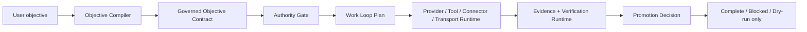

<p align="center">
  
</p>

<p align="center">
  <a href="https://github.com/Orvek-dev/Zeus/releases/tag/v1.0.0"></a>
  <a href="./LICENSE"></a>
  
  
  
  
</p>

<p align="center">
  <a href="#quickstart">Quickstart</a> ·
  <a href="#at-a-glance">At A Glance</a> ·
  <a href="#how-zeus-works">How Zeus Works</a> ·
  <a href="#what-is-different-with-hermes">What Is Different With Hermes</a> ·
  <a href="#evidence">Evidence</a> ·
  <a href="#docs">Docs</a>
</p>

# Zeus Agent

Zeus is a goal-oriented AI agent runtime for governed work. It takes a flexible
user objective, compiles it into an explicit contract, runs through authority
and runtime boundaries, and only treats the work as complete when evidence says
the objective is actually satisfied.

```text
Hermes-style breadth = providers + tools + sessions + gateway + MCP + skills
Zeus control model  = objective contracts + authority gates + evidence + promotion review
```

Zeus is designed to absorb the useful platform shape of Hermes without becoming
an unconstrained chat loop. The public `v1.0.0` release is a deterministic local
runtime foundation: kernel contracts, provider interfaces, tool and connector
runtimes, transport state, work-loop planning, verification, and skill-evolution
guards. Live external AI APIs, MCP servers, gateway delivery, browser control,
terminal execution, and remote runtimes should be connected through the same
authority and evidence boundaries.

## Quickstart

Run this from a fresh clone with Python 3.10 or newer:

```sh
python3 -m venv .venv
source .venv/bin/activate
python -m pip install -U pip
python -m pip install -e ".[dev]"
python -m pytest -q
```

Try the local deterministic runtime surfaces:

```sh
zeus kernel-status
zeus kernel-dump --scenario approved-read --json
zeus wave2-loop --scenario happy --json
zeus final-core --objective "Build a governed research agent" --json
zeus final-eval --json
```

These commands do not require live provider keys. They exercise the public
contract, authority, work-loop, provider, tool, transport, verification, and
promotion boundaries before external systems are wired in.

## At A Glance

| Surface | What it does | Start here |
| --- | --- | --- |
| `kernel` | Capability graph, authority grants, broker decisions, evidence records, completion checks | `zeus kernel-dump --json` |
| `objective_runtime` | Turns open-ended user goals into bounded objective contracts | `zeus final-core --json` |
| `agent_runtime` | Local loop lineage, prompt shaping, compression, conversation surfaces, and orchestration scaffolds | `zeus wave2-loop --json` |
| `model_runtime` | Provider request/response interfaces for fake, local LLM, OpenAI-compatible, and Anthropic metadata paths | `zeus wave10-eval --json` |
| `tool_runtime` | Tool schema registry, visibility filtering, dispatch constraints, and blocked side-effect checks | `zeus wave11-eval --json` |
| `transport_runtime` | Transport manifests, runtime registry gates, and SQLite-backed local state | `zeus wave8-eval --json` |
| `verification_runtime` | Artifact, requirement, and evidence checks before completion or promotion | `zeus final-eval --json` |
| `skill_evolution` | Proposed improvements that cannot self-promote, widen authority, or bypass evidence gates | [Hermes comparison](docs/hermes-comparison.md) |

## How Zeus Works



Zeus keeps the agent layer from owning every runtime concern. The kernel decides
which capabilities exist and what authority has been granted. The runtime
layers decide how providers, tools, connectors, transports, workflow jobs, and
gateway drafts are represented. The verification layer decides whether the
evidence is strong enough to allow completion or promotion.

That split is the point: a user can ask for broad, flexible work, but Zeus still
knows which objective was accepted, which tools were visible, which credentials
were intentionally unavailable, which side effects were blocked, and why a live
path was not promoted.

## What Is Different With Hermes

Hermes is the reference shape for a broad agent platform: CLI and messaging
entry points, provider resolution, tool dispatch, session storage, terminal and
browser backends, MCP integration, skills, memory, cron, and gateway delivery.
Zeus is being built to absorb those same platform axes, but its center of
gravity is different.

| Question | Hermes Agent | Zeus Agent |
| --- | --- | --- |
| Primary product shape | General-purpose self-improving agent that lives across CLI, gateway, ACP, batch, API, and library surfaces | Goal-oriented governed runtime that turns objectives into contracts and evidence obligations |
| Core loop | `AIAgent` builds prompts, resolves providers, dispatches tools, persists sessions, and continues conversation | Objective compiler -> authority gate -> work-loop plan -> runtime dispatch -> evidence -> promotion decision |
| Runtime breadth | Mature live platform with many providers, tools, toolsets, gateways, terminal/browser/web/MCP backends, memory, skills, and cron | Public v1.0.0 foundation with deterministic local provider/tool/connector/transport/workflow/gateway scaffolds and evals |
| Safety center | Approval, profile isolation, tool availability, command checks, gateway authorization, and platform controls | Capability grants, path grants, side-effect labels, runtime leases, fail-closed dispatch, no-secret-echo checks, and promotion blocks |
| Self-improvement | Built-in learning loop and skill creation from experience | Validation-gated skill-evolution queue; proposed skills cannot self-promote, widen authority, enable live transport, or bypass evidence |
| Completion model | Conversational progress and tool-visible execution | Evidence-backed completion; "done" is blocked when objective, artifact, verification, or promotion evidence is missing |

Short version:

```text
Hermes optimizes for agent breadth and lived usability.
Zeus optimizes for objective control, authority, evidence, and safe promotion.
```

Read the longer comparison in [docs/hermes-comparison.md](docs/hermes-comparison.md).

## Evidence

The latest public-safe local evidence snapshot was measured on 2026-06-02. Read
these numbers as deterministic local regression evidence for the public source
release, not as proof of broad production readiness.

| Evidence surface | Public-safe signal | Current result |
| --- | --- | --- |
| Unit and scenario tests | Kernel, objective, provider, tool, transport, workflow, gateway, verification, and skill-evolution surfaces | `204` tests passed |
| Final architecture eval | Objective compiled, work loop created, promotion live-disabled, adversarial blocks, no secret echo, state reload | `9/9` checks passed |
| Python compile check | `src` and `tests` compile under Python 3.12 local validation | passed |
| Package build | Editable install, sdist, and wheel build for `zeus-agent==1.0.0` | passed |
| GitHub Actions | Python 3.10, 3.11, and 3.12 CI matrix | passed |
| Public safety boundary | Local Codex harness packs, private planning notes, evidence logs, runtime DBs, and machine-local artifacts excluded | clean public tree |

The release does not claim hosted SaaS readiness, live external provider
execution, production MCP catalogs, unattended gateway operations, browser or
terminal automation, remote sandbox hard isolation, or third-party production
validation. Those claims remain blocked until live integrations are wired
through the authority, lease, evidence, and rollback contracts.

## v1.0.0 Readiness

`v1.0.0` is the first public Zeus Agent source release. The supported public
surface is:

- local deterministic CLI scenarios through `zeus`;
- objective compilation and governed runtime contract models;
- authority-gated capability broker behavior;
- provider, tool, connector, transport, workflow, gateway, verification, and
  skill-evolution scaffolds;
- public-safe tests, package metadata, README, security policy, and CI.

The current release is a foundation for Hermes-like generality, not a claim
that every Hermes live surface is already production-active.

## Commands

```sh
# Kernel and authority
zeus kernel-status
zeus kernel-dump --scenario approved-read --json
zeus kernel-dump --scenario unapproved-terminal --json

# Local loop and runtime slices
zeus wave2-loop --scenario happy --json
zeus wave8-eval --json
zeus wave10-eval --json
zeus wave11-eval --json
zeus wave12-eval --json
zeus wave13-eval --json

# Product-level checks
zeus final-core --objective "Build a governed coding agent" --json
zeus final-adversarial --json
zeus final-state --json
zeus final-eval --json
```

## Repository Layout

```text
src/zeus_agent/
  kernel/                 authority, capability graph, broker, evidence
  objective_runtime/      objective contracts and compiler
  agent_runtime/          local loop, prompt, lineage, compression, conversation
  model_runtime/          provider interfaces and local/API-compatible adapters
  tool_runtime/           tool schema registry and dispatch boundaries
  connector_runtime/      external connector lifecycle and execution contracts
  transport_runtime/      runtime transport registry, probes, manifests, state
  workflow_runtime/       schedule and job scaffolds
  gateway_runtime/        local gateway drafts and delivery records
  runtime_lease/          dry-run/live lease and promotion controls
  verification_runtime/   artifact and evidence validation
  skill_evolution/        proposed skill queue and promotion review guards
tests/                    public deterministic scenario and contract tests
docs/                     public architecture and Hermes comparison notes
```

## Docs

| Document | Purpose |
| --- | --- |
| [Hermes comparison](docs/hermes-comparison.md) | Hermes baseline architecture, Zeus architecture, and why Zeus should keep a governed kernel/runtime split |
| [Security policy](SECURITY.md) | Public security posture and current v1.0.0 boundary |
| [Changelog](CHANGELOG.md) | Release history and public-safe notes |

## License

Zeus is released under the MIT License. See [LICENSE](LICENSE).
