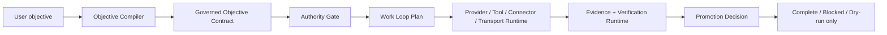

<p align="center">
  
</p>

<p align="center">
  <a href="https://github.com/Orvek-dev/Zeus/releases/tag/v1.0.0-rc.4"></a>
  <a href="./LICENSE"></a>
  
  
  
  
</p>

<p align="center">
  <a href="#quickstart">Quickstart</a> ·
  <a href="#at-a-glance">At A Glance</a> ·
  <a href="#zeus-core-language">Zeus Core Language</a> ·
  <a href="#how-zeus-works">How Zeus Works</a> ·
  <a href="#what-is-different-with-hermes">What Is Different With Hermes</a> ·
  <a href="#live-connection-design">Live Connection Design</a> ·
  <a href="#evidence">Evidence</a> ·
  <a href="#docs">Docs</a>
</p>

# Zeus Agent

Zeus is a goal-oriented AI agent runtime for governed work. It takes a flexible
user objective, compiles it into an explicit contract, runs through authority
and runtime boundaries, and only treats the work as complete when evidence says
the objective is actually satisfied.

```text
Hermes-style breadth = providers + tools + sessions + gateway + MCP + skills
Zeus control model  = objective contracts + authority gates + evidence + promotion review
```

Zeus is designed to absorb the useful platform shape of Hermes without becoming
an unconstrained chat loop. The public `v1.0.0-rc.4` source checkpoint adds the
Gateway Live Delivery surface on top of Provider Live API and MCP Live Server:
a governed loopback gateway delivery path that composes configured target
allowlist, pairing proof, runtime lease, credential binding, secret material
proof, delivery envelope, delivery body, execution authorization, loopback
transport, loopback HTTP delivery, audit, response redaction, and cleanup
without claiming external gateway delivery, webhook production execution, or
production live readiness. Browser control, terminal execution, remote
runtimes, hosted gateways, and production external AI APIs should still be
connected through the same authority, lease, approval, sandbox, evidence,
retention, and promotion boundaries.

## Quickstart

Run this from a fresh clone with Python 3.10 or newer:

```sh
python3 -m venv .venv
source .venv/bin/activate
python -m pip install -U pip
python -m pip install -e ".[dev]"
python -m pytest -q
```

Try the local deterministic runtime surfaces:

```sh
zeus kernel-status
zeus kernel-dump --scenario approved-read --json
zeus wave2-loop --scenario happy --json
zeus final-core --objective "Build a governed research agent" --json
zeus final-eval --json
zeus total-plan --json
zeus total-blocks --secret-like ghp_TEST_FIXTURE --json
zeus total-eval --json
zeus release-gated-ulw --target-version v1.0.0-rc.4 --json
zeus tool-limbs --tool-id files.read --json
zeus platform-surface --surface gateway --json
zeus memory-ontology --subject Zeus --json
zeus adaptive-zeus --objective "Implement provider, MCP catalog, cron, and review slices" --task-count 5 --requires-code --requires-research --json
zeus live-beta-candidate --include-smoke --scenario happy --json
zeus production-foundation --include-credentials --json
zeus provider-live-api --scenario status --json
ZEUS_RC2_PROVIDER_KEY=provider-rc2-material-value zeus provider-live-api --scenario loopback-smoke --secret-ref env://ZEUS_RC2_PROVIDER_KEY --json
zeus mcp-live-server --scenario status --json
ZEUS_RC3_MCP_TOKEN=mcp-rc3-token-value zeus mcp-live-server --scenario loopback-smoke --secret-ref env://ZEUS_RC3_MCP_TOKEN --json
zeus mcp-live-server --scenario prompt-injection-scan --json
zeus gateway-live-delivery --scenario status --json
ZEUS_RC4_GATEWAY_TOKEN=local-fixture-value zeus gateway-live-delivery --scenario loopback-smoke --secret-ref env://ZEUS_RC4_GATEWAY_TOKEN --json
ZEUS_RC4_GATEWAY_TOKEN=local-fixture-value zeus gateway-live-delivery --scenario blocked-target --target discord://ops --secret-ref env://ZEUS_RC4_GATEWAY_TOKEN --json
```

Status commands do not require live provider keys. The loopback smoke commands
use session-local fixture environment references and do not contact external
services. Together they exercise the public contract, authority, work-loop,
provider, MCP, tool, transport, verification, and promotion boundaries before
external systems are wired in.

## At A Glance

| Surface | What it does | Start here |
| --- | --- | --- |
| `kernel` | Capability graph, authority grants, broker decisions, evidence records, completion checks | `zeus kernel-dump --json` |
| `objective_runtime` | Turns open-ended user goals into bounded objective contracts | `zeus final-core --json` |
| `agent_runtime` | Local loop lineage, prompt shaping, compression, conversation surfaces, and orchestration scaffolds | `zeus wave2-loop --json` |
| `model_runtime` | Provider request/response interfaces for fake, local LLM, OpenAI-compatible, and Anthropic metadata paths | `zeus wave10-eval --json` |
| `tool_runtime` | Tool schema registry, visibility filtering, dispatch constraints, blocked side-effect checks, and governed Tool Limbs contracts | `zeus tool-limbs --tool-id files.read --json` |
| `transport_runtime` | Transport manifests, runtime registry gates, and persistent local state | `zeus wave8-eval --json` |
| `platform_surface` | CLI, API, gateway, ACP, batch, and Python library entrypoint contracts without starting handlers | `zeus platform-surface --surface api --json` |
| `verification_runtime` | Artifact, requirement, and evidence checks before completion or promotion | `zeus final-eval --json` |
| `security_runtime` | Live-capable surface planning, runtime lease scope checks, and fail-closed decisions before handler execution | `zeus total-blocks --json` |
| `research_runtime` | Source-pinned research evidence graphs for Hermes/OpenClaw/web/GitHub style synthesis | `zeus total-plan --json` |
| `ontology_runtime` | Provenance-backed ontology candidates that remain proposed or blocked until reviewed | `zeus memory-ontology --json` |
| `memory_ontology_surface` | Local MemoryGraph, LLM Wiki, ontology review queue, retention, and no auto-promotion reporting | `zeus memory-ontology --subject Zeus --json` |
| `orchestration_runtime` | Dry-run parallel scheduler with dependency, evidence, depth, live-surface, and write-scope checks | `zeus total-plan --json` |
| `adaptive_zeus_runtime` | Objective-sensitive workflow selection with critique checkpoints, ULW pattern choice, and no live execution | `zeus adaptive-zeus --objective "Ship a governed feature" --task-count 5 --requires-code --json` |
| `live_beta_candidate_runtime` | RC live-beta summary that composes live cockpit, opt-in smoke, readiness, rollback, review, and no-production boundaries | `zeus live-beta-candidate --include-smoke --json` |
| `production_foundation_runtime` | Production foundation contract for identity/auth, approval, runtime lease, credential binding, secret resolver, audit, sandbox, rollback, and review controls | `zeus production-foundation --include-credentials --json` |
| `provider_live_api_runtime` | Provider Live API contract for controlled loopback provider smoke, secret binding, authorization, audit, redaction, and no external non-loopback production claim | `zeus provider-live-api --scenario status --json` |
| `mcp_live_server_runtime` | MCP Live Server contract for catalog provenance, activation policy, loopback MCP HTTP smoke, prompt-injection scan, audit, redaction, and no remote production claim | `zeus mcp-live-server --scenario status --json` |
| `gateway_live_delivery_runtime` | Gateway Live Delivery contract for target allowlist, pairing proof, delivery envelope/body, loopback transport, loopback HTTP, audit, redaction, and no external delivery claim | `zeus gateway-live-delivery --scenario status --json` |
| `skill_evolution` | Proposed improvements that cannot self-promote, widen authority, or bypass evidence gates | [Hermes comparison](docs/hermes-comparison.md) |

## Zeus Core Language

The Zeus core language has exactly these 12 product-domain pillars. The
technical runtime identifiers are preserved, and product-domain labels do not
rename runtime modules.

| Product name | Technical anchor |
| --- | --- |
| Zeus Kernel | `objective_runtime`, `verification_runtime`, and evidence/authority center |
| Athena | `objective_runtime` |
| Thunderbolt | `runtime_lease` |
| Aegis | `security_runtime`, lease, and sandbox policy |
| Mercury | `transport_runtime`, `connector_runtime`, and MCP/API/gateway routing |
| Apollo | `model_runtime`, `provider_runtime`, and eval boundaries |
| Hephaestus | `tool_runtime` |
| Poseidon | `gateway_runtime` |
| Artemis | `research_runtime` |
| Demeter | `ontology_runtime` and durable state |
| Olympus | `orchestration_runtime` and work-loop coordination |
| Prometheus | `skill_evolution` |

Hermes remains upstream/reference only. Mercury is the Zeus internal transport product name.
Live provider, MCP, web, gateway, browser, plugin, and network
execution remains designed/prepared/dry-run/future unless a later release wires
it through authority, leases, approval, sandboxing, evidence, and promotion.

## How Zeus Works



Zeus keeps the agent layer from owning every runtime concern. The kernel decides
which capabilities exist and what authority has been granted. The runtime
layers decide how providers, tools, connectors, transports, workflow jobs, and
gateway drafts are represented. The verification layer decides whether the
evidence is strong enough to allow completion or promotion.

That split is the point: a user can ask for broad, flexible work, but Zeus still
knows which objective was accepted, which tools were visible, which credentials
were intentionally unavailable, which side effects were blocked, and why a live
path was not promoted.

## What Is Different With Hermes

Hermes is the reference shape for a broad agent platform: CLI and messaging
entry points, provider resolution, tool dispatch, session storage, terminal and
browser backends, MCP integration, skills, memory, cron, and gateway delivery.
Zeus is being built to absorb those same platform axes, but its center of
gravity is different.

| Question | Hermes Agent | Zeus Agent |
| --- | --- | --- |
| Primary product shape | General-purpose self-improving agent that lives across CLI, gateway, ACP, batch, API, and library surfaces | Goal-oriented governed runtime that turns objectives into contracts and evidence obligations |
| Core loop | `AIAgent` builds prompts, resolves providers, dispatches tools, persists sessions, and continues conversation | Objective compiler -> authority gate -> work-loop plan -> runtime dispatch -> evidence -> promotion decision |
| Runtime breadth | Mature live platform with many providers, tools, toolsets, gateways, terminal/browser/web/MCP backends, memory, skills, and cron | Public v1.0.0-rc.4 Gateway Live Delivery checkpoint with deterministic CLI/API/gateway/ACP/batch/library entrypoint contracts, Tool Limbs, native tool catalog, MCP discovery contract, API connector contract, local MemoryGraph, LLM Wiki, ontology review queue, skill-learning memory bridge, adaptive workflow pattern selection, critique checkpoints, live readiness, opt-in smoke, live cockpit, provider/MCP/gateway beta contracts, identity/auth/approval/lease/credential/secret/audit/sandbox controls, production foundation contracts, loopback provider HTTP smoke, loopback MCP HTTP smoke, MCP prompt-injection scan, loopback gateway delivery, release-gated authority/lease evidence, total architecture contracts, and Zeus Core Language |
| Safety center | Approval, profile isolation, tool availability, command checks, gateway authorization, and platform controls | Capability grants, path grants, side-effect labels, runtime leases, fail-closed dispatch, no-secret-echo checks, and promotion blocks |
| Self-improvement | Built-in learning loop and skill creation from experience | Validation-gated skill-evolution queue; proposed skills cannot self-promote, widen authority, enable live transport, or bypass evidence |
| Completion model | Conversational progress and tool-visible execution | Evidence-backed completion; "done" is blocked when objective, artifact, verification, or promotion evidence is missing |

Short version:

```text
Hermes optimizes for agent breadth and lived usability.
Zeus optimizes for objective control, authority, evidence, and safe promotion.
```

Read the longer comparison in [docs/hermes-comparison.md](docs/hermes-comparison.md).

## Live Connection Design

`v1.0.0-rc.4` includes the public Gateway Live Delivery checkpoint for attaching
gateway delivery targets through a governed contract. It proves configured
target allowlist, pairing proof, runtime lease, credential binding, secret
material proof, delivery envelope, delivery body, execution authorization,
loopback transport, loopback HTTP delivery, audit, redaction, and cleanup.
Native tools, web research, browser or terminal automation, remote sandboxes,
remote MCP servers, hosted gateways, and production external AI APIs remain
future live surfaces that must pass through entrypoint contracts, adaptive
workflow selection, live readiness, opt-in smoke, identity/auth controls,
runtime lease, credential binding, secret resolver, audit, sandbox, rollback,
review, and retention/promotion boundaries before production live execution is
enabled.

The intended live path is:

```text
objective contract -> runtime lease -> security planning -> approval receipt
-> live connection router -> provider/MCP/tool/gateway/web/sandbox adapter
-> evidence + audit -> verification + promotion decision
```

Read the full blueprint in
[docs/live-connection-architecture.md](docs/live-connection-architecture.md).
The important boundary is that the live adapter layer must not bypass Zeus's
kernel. A provider key, MCP server, browser backend, terminal command, or
gateway delivery target becomes available only when it is leased, approved when
needed, sandboxed, audited, and verified against the objective.

## Evidence

The latest public-safe local evidence snapshot was measured on 2026-06-06. Read
these numbers as deterministic local regression evidence for the public source
release, not as proof of broad production readiness.

| Evidence surface | Public-safe signal | Current result |
| --- | --- | --- |
| Unit and scenario tests | Kernel, objective, provider, tool, transport, workflow, gateway/API, live loop, MCP manager, tool sandbox, research provider, observability, verification, skill-evolution, release-gated ULW, Tool Limbs, Platform Surface, Memory/Ontology, Adaptive Zeus, Live Beta Candidate, Production Foundation, Provider Live API, MCP Live Server, Gateway Live Delivery, core language, release version, public docs hygiene, and total architecture surfaces | `1288` public tests passed |
| Final architecture eval | Objective compiled, work loop created, promotion live-disabled, adversarial blocks, core language mapping, no secret echo, state reload | `10/10` checks passed |
| Total architecture eval | Security planning, research graph, ontology candidates, sandbox workflow, scheduler, fail-closed live blocks, core language mapping, no secret echo, no live surface opened | `9/9` checks passed |
| Python compile check | `src` and `tests` compile under Python 3.12 local validation | passed |
| Package build | Editable install, sdist, and wheel build for `zeus-agent==1.0.0rc4` | passed |
| GitHub Actions | Python 3.10, 3.11, and 3.12 CI matrix | pending remote CI after Git publication |
| Public safety boundary | Local Codex control packs, private planning notes, evidence logs, runtime DBs, and machine-local artifacts excluded | clean public tree |

The release does not claim hosted SaaS readiness, live external provider
execution, production MCP catalogs, unattended gateway operations, browser or
terminal automation, remote sandbox hard isolation, or third-party production
validation. Those claims remain blocked until live integrations are wired
through the authority, lease, evidence, and rollback contracts.

## v1.0.0-rc.4 Readiness

`v1.0.0-rc.4` is a governed Gateway Live Delivery source checkpoint. The
supported public surface is:

- local deterministic CLI scenarios through `zeus`;
- `release-gated-ulw --target-version v1.0.0-rc.4 --json` for the sequential
  v0.6.0 -> v1.0.0-rc.4 release-gate program contract;
- `tool-limbs --tool-id files.read --json` for governed native tool, MCP
  discovery, and API connector boundary reporting;
- `platform-surface --surface gateway --json` for governed CLI, API, gateway,
  ACP, batch, and Python library entrypoint boundary reporting;
- `memory-ontology --subject Zeus --json` for local MemoryGraph, LLM Wiki,
  ontology review queue, skill-learning memory, retention policy, and
  no-auto-promotion boundary reporting. This status surface may initialize the
  local SQLite MemoryGraph schema under the selected Zeus home, but it does not
  open network access, run handlers, promote ontology terms, or write active
  rules;
- `adaptive-zeus --objective "..." --task-count N --json` for objective
  sensitive workflow selection across lean ULW, classify-and-act, parallel
  fan-out synthesis, and adversarial verification. This status surface does not
  self-modify workflows, auto-write memory, promote learned rules, open
  network access, or execute handlers;
- `live-beta-candidate --include-smoke --scenario happy --json` for the RC
  live beta candidate contract. It composes live readiness, opt-in smoke, live
  cockpit, approval/lease/rollback/review controls, and provider/MCP/gateway
  beta evidence without claiming production readiness;
- `production-foundation --include-credentials --json` for identity/auth,
  approval, runtime lease, credential binding, secret resolver, audit, sandbox,
  rollback, and independent-review controls without opening network access or
  reading credential material;
- `provider-live-api --scenario status --json` for governed provider live API
  readiness without opening network access;
- `provider-live-api --scenario loopback-smoke --secret-ref env://ZEUS_RC2_PROVIDER_KEY --json`
  for session-local loopback provider smoke when the operator intentionally
  supplies a scoped environment secret reference. This smoke uses loopback only,
  redacts response/secret-bearing material, captures audit evidence, and shuts
  the local smoke server down before reporting readiness;
- `mcp-live-server --scenario status --json` for governed MCP catalog,
  activation-policy, request-envelope, and loopback readiness without opening
  network access;
- `mcp-live-server --scenario loopback-smoke --secret-ref env://ZEUS_RC3_MCP_TOKEN --json`
  for session-local MCP HTTP loopback smoke when the operator intentionally
  supplies a scoped environment secret reference. This smoke uses loopback only,
  keeps remote MCP/resources/prompts disabled, redacts response/secret-bearing
  material, captures audit evidence, and shuts the local smoke server down
  before reporting readiness;
- `mcp-live-server --scenario prompt-injection-scan --json` for MCP tool
  description scanning that blocks unsafe prompt-injection markers without
  opening network access;
- `gateway-live-delivery --scenario status --json` for governed gateway target
  allowlist, pairing, delivery envelope/body, loopback transport, and loopback
  HTTP readiness without opening network access;
- `gateway-live-delivery --scenario loopback-smoke --secret-ref env://ZEUS_RC4_GATEWAY_TOKEN --json`
  for session-local gateway loopback delivery smoke when the operator
  intentionally supplies a scoped environment secret reference. This smoke uses
  loopback only, keeps external webhooks disabled, redacts secret-bearing
  material, captures audit evidence, and shuts the local smoke server down
  before reporting readiness;
- `gateway-live-delivery --scenario blocked-target --target discord://ops --json`
  for delivery-target allowlist enforcement without opening network access;
- objective compilation and governed runtime contract models;
- authority-gated capability broker behavior;
- provider, tool, connector, transport, workflow, gateway, verification, and
  skill-evolution scaffolds;
- native tool catalog reporting with MCP/API dry-run contract checks,
  include/exclude policy, approval lease, security gate, evidence capture, and
  no-secret-echo boundaries;
- platform entrypoint reporting with loopback defaults, non-loopback review,
  auth/pairing/allowlist posture, approval lease, security gate, evidence
  capture, and no live handler execution;
- security planning, research graph, memory graph, LLM Wiki, ontology
  candidate, sandbox workflow, and
  dry-run orchestration contracts;
- public live connection architecture for future provider, MCP, web, gateway,
  browser, terminal, and sandbox adapters;
- public-safe tests, package metadata, README, security policy, and remote CI
  handoff readiness.

The current release is a foundation for Hermes-like generality, not a claim
that every Hermes live surface is already production-active.

## Commands

```sh
# Kernel and authority
zeus kernel-status
zeus kernel-dump --scenario approved-read --json
zeus kernel-dump --scenario unapproved-terminal --json

# Local loop and runtime slices
zeus wave2-loop --scenario happy --json
zeus wave8-eval --json
zeus wave10-eval --json
zeus wave11-eval --json
zeus wave12-eval --json
zeus wave13-eval --json
zeus total-plan --json
zeus total-blocks --secret-like ghp_TEST_FIXTURE --json
zeus total-eval --json
zeus release-gated-ulw --target-version v1.0.0-rc.4 --json
zeus tool-limbs --tool-id files.read --json
zeus platform-surface --surface gateway --json
zeus memory-ontology --subject Zeus --json
zeus adaptive-zeus --objective "Implement provider, MCP catalog, cron, and review slices" --task-count 5 --requires-code --requires-research --json
zeus live-beta-candidate --include-smoke --scenario happy --json
zeus production-foundation --include-credentials --json
zeus provider-live-api --scenario status --json
ZEUS_RC2_PROVIDER_KEY=provider-rc2-material-value zeus provider-live-api --scenario loopback-smoke --secret-ref env://ZEUS_RC2_PROVIDER_KEY --json
zeus mcp-live-server --scenario status --json
ZEUS_RC3_MCP_TOKEN=mcp-rc3-token-value zeus mcp-live-server --scenario loopback-smoke --secret-ref env://ZEUS_RC3_MCP_TOKEN --json
zeus mcp-live-server --scenario prompt-injection-scan --json
zeus gateway-live-delivery --scenario status --json
ZEUS_RC4_GATEWAY_TOKEN=local-fixture-value zeus gateway-live-delivery --scenario loopback-smoke --secret-ref env://ZEUS_RC4_GATEWAY_TOKEN --json
ZEUS_RC4_GATEWAY_TOKEN=local-fixture-value zeus gateway-live-delivery --scenario blocked-target --target discord://ops --secret-ref env://ZEUS_RC4_GATEWAY_TOKEN --json

# Product-level checks
zeus final-core --objective "Build a governed coding agent" --json
zeus final-adversarial --json
zeus final-state --json
zeus final-eval --json
```

## Repository Layout

```text
src/zeus_agent/
  kernel/                 authority, capability graph, broker, evidence
  objective_runtime/      objective contracts and compiler
  agent_runtime/          local loop, prompt, lineage, compression, conversation
  model_runtime/          provider interfaces and local/API-compatible adapters
  tool_runtime/           tool schema registry and dispatch boundaries
  connector_runtime/      external connector lifecycle and execution contracts
  transport_runtime/      runtime transport registry, probes, manifests, state
  workflow_runtime/       schedule and job scaffolds
  gateway_runtime/        local gateway drafts and delivery records
  runtime_lease/          dry-run/live lease and promotion controls
  security/               live-capable surface planning and credential-scope checks
  research_runtime/       source-pinned research evidence graph contracts
  memory_ontology_surface_runtime/
                           local MemoryGraph, LLM Wiki, ontology review surface
  adaptive_zeus_runtime/   adaptive ULW pattern selection and critique contracts
  live_beta_candidate_runtime/
                           RC live-beta candidate readiness and smoke contract
  mcp_live_server_runtime/
                           MCP live-server status, loopback smoke, prompt scan
  gateway_live_delivery_runtime/
                           gateway allowlist, pairing, loopback delivery smoke
  ontology_runtime/       proposed ontology terms with provenance controls
  capability_runtime/     sandbox policy and workflow optimization hints
  orchestration_runtime/  dry-run parallel scheduling with write-scope checks
  total_runtime/          composed Hermes/OpenClaw absorption scenarios
  verification_runtime/   artifact and evidence validation
  skill_evolution/        proposed skill queue and promotion review guards
tests/                    public deterministic scenario and contract tests
docs/                     public architecture and Hermes comparison notes
```

## Docs

| Document | Purpose |
| --- | --- |
| [Hermes comparison](docs/hermes-comparison.md) | Hermes baseline architecture, Zeus architecture, and why Zeus should keep a governed kernel/runtime split |
| [Hermes-grade platform master design](docs/hermes-grade-platform-master-design.md) | Target product, UX, architecture, security, and roadmap contract for reaching at least Hermes-half live platform breadth |
| [Live connection architecture](docs/live-connection-architecture.md) | Target design for real AI API, MCP, tool, gateway, web, browser, terminal, and sandbox connections |
| [Security policy](SECURITY.md) | Public security posture and current v1.0.0-rc.4 boundary |
| [Changelog](CHANGELOG.md) | Release history and public-safe notes |

## License

Zeus is released under the MIT License. See [LICENSE](LICENSE).
