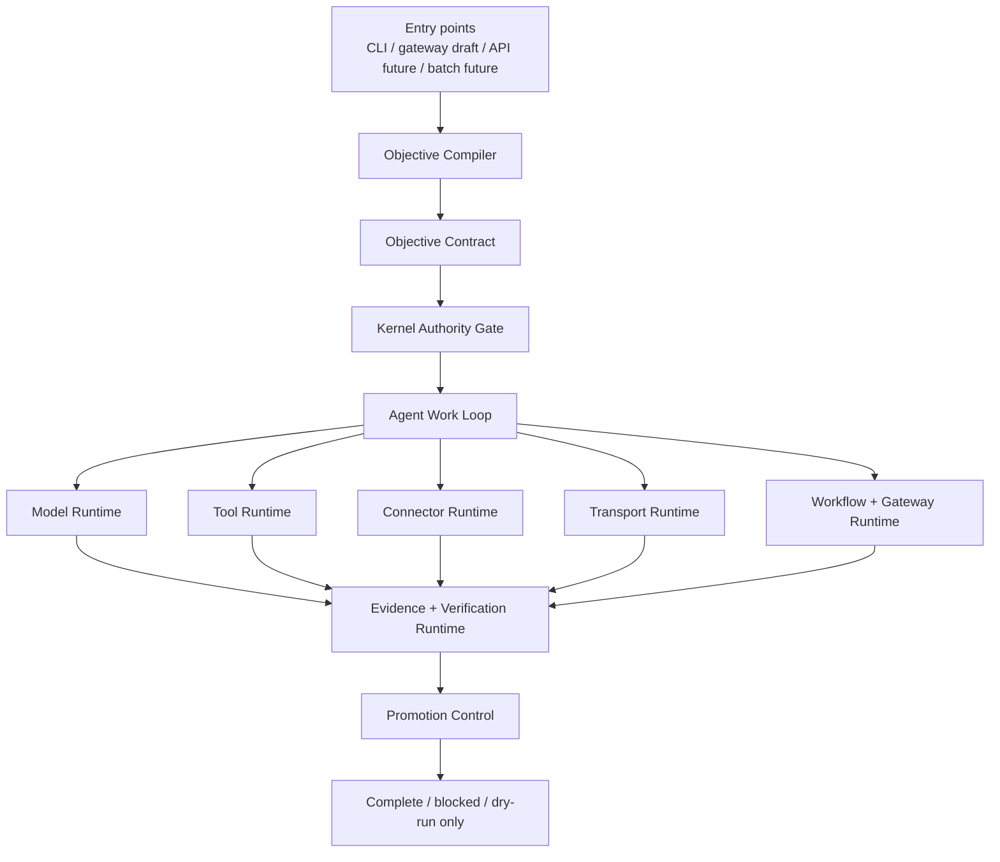

# Zeus And Hermes

This document records the public architecture relationship between Zeus Agent
and [Hermes Agent](https://github.com/NousResearch/hermes-agent).

Hermes is the breadth reference: a general-purpose AI agent platform with
terminal, gateway, provider, tool, MCP, memory, skills, cron, and session
surfaces. Zeus is designed to absorb that platform breadth, but its product
center is different: objective contracts, authority gates, evidence, and
controlled promotion.

## Hermes Baseline Architecture

Hermes documentation describes a platform centered on one shared `AIAgent`
runtime used by multiple entry points:

- CLI
- Messaging gateway
- ACP/editor adapter
- Batch runner
- API server
- Python library

Inside the runtime, Hermes combines prompt building, provider resolution, tool
dispatch, context compression, session persistence, and tool backend routing.
Its official architecture map calls out:

- provider resolution across multiple API modes;
- a central tool registry and dispatch path;
- SQLite + FTS5 session storage;
- terminal, browser, web, MCP, file, vision, and related backends;
- gateway adapters, cron jobs, plugins, memory providers, context engines, and
  trajectory generation.

The important lesson for Zeus is not that every subsystem should live inside
one giant agent class. The lesson is that a useful general agent platform needs
breadth: many entry points, many runtime backends, persistent sessions, tools,
MCP, skills, scheduled work, and external messaging.

## Zeus Target Architecture

Zeus keeps the Hermes breadth axes but moves the governing center from
conversation to objective control.

Zeus layers:

| Layer | Job |
| --- | --- |
| Kernel | Capability graph, authority grants, path grants, broker decisions, evidence records, completion checks |
| Objective runtime | Compile user goals into explicit contracts, deliverables, constraints, and verification obligations |
| Agent runtime | Local work loop, prompt context, lineage, compression, conversation turns, and orchestration scaffolds |
| Model runtime | Provider request/response contracts, local LLM adapter, OpenAI-compatible adapter, fake provider, metadata provider |
| Tool runtime | Tool schema registry, visibility filtering, dispatch constraints, blocked side effects |
| Connector runtime | External connector lifecycle and execution contracts |
| Transport runtime | Runtime manifests, probes, registry gates, and persistent local database-backed state |
| Workflow runtime | Schedule and job contracts for future recurring work |
| Gateway runtime | Local gateway drafts and delivery record scaffolds |
| Verification runtime | Artifact checks, requirement checks, evidence checks, and completion guardrails |
| Skill evolution | Proposed improvement queue with explicit review and promotion blocks |

## Product-Domain Layer

Public Zeus architecture language now separates product-domain names from
technical runtime identifiers. The reduced Zeus core language has exactly 12
pillars: Zeus Kernel, Athena, Thunderbolt, Aegis, Mercury, Apollo, Hephaestus,
Poseidon, Artemis, Demeter, Olympus, and Prometheus. The technical runtime
identifiers are preserved; product-domain labels do not rename runtime modules.

Hermes remains upstream/reference only. Mercury is the Zeus internal transport product name
for transport, connector, MCP, API, and gateway routing boundaries.
The current public boundary remains designed/prepared/dry-run/future for live
provider, MCP, web, gateway, browser, plugin, and network execution unless later
evidence proves those integrations are active through Zeus authority gates.

## What Zeus Shares With Hermes

Zeus should eventually support the same broad platform categories:

- local CLI operation;
- model provider routing;
- local and external tool registries;
- MCP server integration;
- terminal, browser, web, file, and remote runtime backends;
- persistent session and memory state;
- gateway or messaging delivery;
- scheduled tasks;
- skill creation and skill reuse;
- trajectory and eval surfaces.

The public `v1.5.0` code does not claim all live surfaces are production-active.
It establishes the contracts, total architecture dry-run checks, Tool Limbs,
Platform Surface boundary, Memory/Ontology boundary, Adaptive Zeus workflow
selection boundary, Live Beta Candidate boundary, Production Foundation
boundary, Provider Live API boundary, MCP Live Server boundary, Gateway Live
Delivery boundary, Sandbox Terminal Live boundary, Memory Privacy Live boundary,
Provider Live Opt-in boundary, Provider Owned Client Live boundary, MCP Owned
Client Live boundary, Stable Release boundary, Real Provider Runtime boundary,
Real MCP Runtime boundary, Real Platform Runtime boundary, Real Execution Runtime boundary, Real Memory Operation Runtime boundary, and live connection design those
surfaces should pass through.

## What Is Different With Hermes

| Axis | Hermes | Zeus |
| --- | --- | --- |
| Center of gravity | General assistant platform that can live across terminal, gateway, ACP, cron, and messaging surfaces | Goal-oriented control runtime that converts flexible work into objective contracts and verification obligations |
| Default unit of work | Conversation turn, tool call, session, gateway message, scheduled job | Objective contract, authority grant, work-loop step, evidence record, promotion decision |
| Runtime organization | Broad platform capabilities route through `AIAgent` and shared tool/provider/session machinery | Runtime capabilities are split behind kernel, objective, model, tool, connector, transport, workflow, gateway, verification, and skill-evolution layers |
| Safety posture | Tool approval, command checks, profile isolation, session/gateway authorization, backend availability | Capability grants, path grants, side-effect labels, runtime leases, fail-closed dispatch, no-secret-echo, and evidence-backed completion |
| Self-improvement | Agent learning loop creates and improves skills from experience | Skill proposals are generated but cannot self-promote, widen authority, enable live transport, or bypass evidence gates |
| Completion claim | Agent reports progress through conversation and visible tool execution | Completion is blocked unless evidence and verification obligations support the objective |
| Live capability | Mature live ecosystem with many providers, gateways, tools, MCP, cron, and terminal/browser backends | v1.5.0 is a governed live platform boundary with CLI/API/gateway/ACP/batch/library entrypoint contracts, Tool Limbs, native tool catalog reporting, MCP discovery and API connector dry-run contracts, local MemoryGraph, LLM Wiki, ontology review queue, skill-learning memory bridge, adaptive workflow pattern selection, critique checkpoints, live readiness, opt-in smoke, live cockpit, provider/MCP/gateway beta contracts, identity/auth/approval/lease/credential/secret/audit/sandbox controls, production foundation contracts, release-gated provider/MCP/gateway loopback readiness, controlled loopback provider HTTP smoke, controlled loopback MCP HTTP smoke, MCP prompt-injection scan, controlled loopback gateway delivery, governed local sandbox command smoke, browser live-navigation guard, Memory Privacy Live secret quarantine, retention deletion, cross-session search default-deny, no-auto-promotion posture, Provider Live Opt-in external receipt validation, Provider Owned Client Live adapter execution, MCP Owned Client Live remote tool execution, Real Provider Runtime reporting, Real MCP Runtime reporting, Real Platform Runtime reporting for API dry-run, gateway loopback sessions, session export redaction, and batch/ACP smoke, Real Execution Runtime reporting for controlled local terminal/sandbox smoke, live browser guard, network-command block, and remote sandbox block, Real Memory Operation Runtime reporting for local MemoryGraph, ontology/wiki, secret quarantine, retention delete, skill-learning bridge, and promotion block, Stable Release reporting, and stabilized Zeus Core Language; production live integrations remain behind the same governance boundary |

Zeus should not simply put a Hermes-like runtime inside an "agent layer" and
call it done. Some runtime concerns should sit outside the agent loop:

- authority policy belongs in the kernel;
- provider routing belongs in model runtime;
- MCP, tool, and connector discovery belong in runtime registries;
- gateway delivery and cron jobs belong in workflow/gateway runtime;
- evidence and promotion belong in verification runtime;
- skill evolution belongs behind review and promotion control.

That separation prevents the agent loop from silently granting itself new
authority or declaring completion without durable proof.

## Why This Should Be Zeus Architecture

Zeus's target user wants flexible outcomes, not just a generic chat agent. The
agent should be able to behave broadly like Hermes, but when the objective is
meaningful it must also answer stricter questions:

- What exact objective was accepted?
- Which constraints and forbidden actions apply?
- Which capabilities were visible to the model?
- Which authority grants allowed or blocked a tool?
- Which runtime path was dry-run only?
- What evidence proves completion?
- Why was live promotion allowed or blocked?
- Can a self-evolution proposal change behavior without review?

Hermes provides the platform breadth. Zeus adds a stronger governance spine for
objective-oriented work.

## Current v1.5.0 Boundary

Implemented public foundation:

- objective compiler and contract models;
- authority-gated capability broker;
- local deterministic agent loop scaffolds;
- provider, tool, connector, transport, workflow, gateway, verification, and
  skill-evolution contracts;
- governed Tool Limbs reporting for native tools, MCP discovery, and API
  connector dry-run contracts;
- governed Platform Surface reporting for CLI, API, gateway, ACP, batch, and
  Python library entrypoint contracts;
- governed Memory/Ontology reporting for local MemoryGraph, LLM Wiki, ontology
  review queue, skill-learning memory, retention policy, and no-auto-promotion
  contracts;
- governed Adaptive Zeus reporting for objective-sensitive ULW pattern
  selection, critique checkpoints, parallel fan-out synthesis plans, lean ULW
  plans, adversarial verification plans, and no self-modification/no
  auto-memory-write boundaries;
- governed Live Beta Candidate reporting for live readiness, local opt-in
  smoke, live cockpit state, provider/MCP/gateway beta evidence, rollback,
  approval, lease, and independent-review controls;
- governed Production Foundation reporting for identity/auth, approval, runtime
  lease, credential binding, secret resolver, audit, sandbox, rollback, and
  independent-review controls;
- governed Provider Live API reporting for status-only readiness, loopback
  provider smoke, provider readiness, runtime lease, credential binding, secret
  material proof, execution authorization, transport audit, response redaction,
  and cleanup;
- governed MCP Live Server reporting for status-only readiness, catalog
  provenance, activation policy, request envelope, loopback HTTP smoke,
  prompt-injection scanning, credential binding, secret material proof,
  execution authorization, transport audit, response redaction,
  resources/prompts disabled posture, remote-server blocked posture, and
  cleanup;
- governed Gateway Live Delivery reporting for status-only readiness,
  configured target allowlist, pairing proof, delivery envelope, delivery body,
  loopback transport, loopback HTTP delivery, credential binding, secret
  material proof, execution authorization, transport audit, response redaction,
  external delivery blocked posture, webhook blocked posture, and cleanup;
- governed Sandbox Terminal Live reporting for status-only readiness, terminal
  planning, sandbox dispatch planning, browser live-navigation guard checks,
  lease-bound sandbox executor dispatch, approval-bound command execution, safe
  environment use, evidence capture, network/Docker/SSH blocked posture, and
  cleanup;
- governed Memory Privacy Live reporting for status-only readiness, local SQLite
  MemoryGraph schema readiness, explicit local fact smoke, secret quarantine,
  retention deletion, cross-session search default-deny, no active-rule writes,
  no ontology/learned-rule auto-promotion, and no network or credential access;
- governed Provider Live Opt-in reporting for status-only readiness, explicit
  operator opt-in enforcement, endpoint allowlisting, scoped secret references,
  remote transport policy, remote executor preflight, external provider receipt
  validation, audit, redaction, and no production-ready claim;
- governed Provider Owned Client Live reporting for status-only readiness,
  owned client adapter execution, scoped secret proof, credential handoff,
  remote transport policy, remote executor preflight, owned client receipt
  validation, audit, redaction, cleanup, and no production-ready claim;
- governed Real Provider Runtime reporting for provider profile catalog,
  governed local deterministic provider smoke, controlled external provider
  receipt validation, budget/timeout gates, audit, redaction, and no
  production-ready claim;
- governed Real MCP Runtime reporting for MCP catalog, setup dry-run, list,
  inspect, fake-client test smoke, login dry-run, include/exclude policy,
  resource/prompt wrapper blocks, prompt-injection quarantine, cleanup, and
  no-production-ready claim;
- governed MCP Owned Client Live reporting for status-only readiness, remote
  MCP tool execution through an owned client adapter, scoped secret proof,
  credential handoff, remote MCP policy, remote executor preflight, owned client
  receipt validation, audit, redaction, cleanup, resources/prompts disabled
  posture, and no production-ready claim;
- governed Stable Release reporting for the public stable platform boundary
  while keeping unrestricted live production execution disabled by default;
- security planning, research graph, ontology candidate, sandbox workflow, and
  dry-run orchestration contracts;
- stabilized Zeus Core Language mapped to technical runtime anchors;
- local database-backed state for runtime/transport/product slices;
- CLI eval surfaces;
- 1381 public tests, a 10/10 final architecture eval, and a 9/9 total
  architecture eval;
- release-gated ULW status for the v0.6.0 -> v1.5.0 program with
  v1.5.0 real memory operation runtime checkpoint reporting;
- live connection architecture for future provider, MCP, web, gateway, browser,
  terminal, and sandbox adapters.

Not claimed yet:

- production MCP catalog;
- remote MCP server production execution;
- MCP resources/prompts activation;
- live multi-provider setup wizard;
- messaging gateway daemon;
- browser live navigation and remote terminal automation in a hard-isolated sandbox;
- hosted API server;
- remote runtime execution;
- unattended cron delivery;
- third-party production validation.

These future surfaces should be added as runtime integrations, not as shortcuts
around the Zeus kernel.

## Source Notes

- Hermes architecture docs:
  <https://hermes-agent.nousresearch.com/docs/developer-guide/architecture>
- Hermes MCP docs:
  <https://hermes-agent.nousresearch.com/docs/user-guide/features/mcp>
- Hermes README:
  <https://github.com/NousResearch/hermes-agent>
