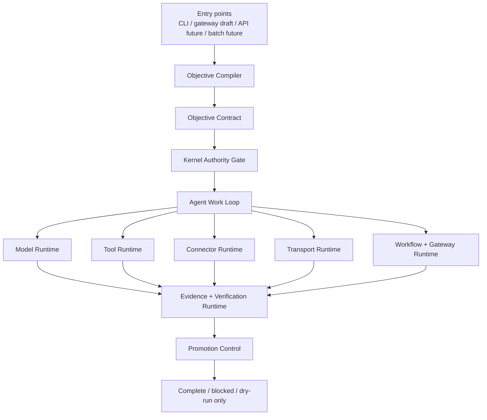

# Zeus And Hermes

This document records the public architecture relationship between Zeus Agent
and [Hermes Agent](https://github.com/NousResearch/hermes-agent).

Hermes is the breadth reference: a general-purpose AI agent platform with
terminal, gateway, provider, tool, MCP, memory, skills, cron, and session
surfaces. Zeus is designed to absorb that platform breadth, but its product
center is different: objective contracts, authority gates, evidence, and
controlled promotion.

## Hermes Baseline Architecture

Hermes documentation describes a platform centered on one shared `AIAgent`
runtime used by multiple entry points:

- CLI
- Messaging gateway
- ACP/editor adapter
- Batch runner
- API server
- Python library

Inside the runtime, Hermes combines prompt building, provider resolution, tool
dispatch, context compression, session persistence, and tool backend routing.
Its official architecture map calls out:

- provider resolution across multiple API modes;
- a central tool registry and dispatch path;
- SQLite + FTS5 session storage;
- terminal, browser, web, MCP, file, vision, and related backends;
- gateway adapters, cron jobs, plugins, memory providers, context engines, and
  trajectory generation.

The important lesson for Zeus is not that every subsystem should live inside
one giant agent class. The lesson is that a useful general agent platform needs
breadth: many entry points, many runtime backends, persistent sessions, tools,
MCP, skills, scheduled work, and external messaging.

## Zeus Target Architecture

Zeus keeps the Hermes breadth axes but moves the governing center from
conversation to objective control.

Zeus layers:

| Layer | Job |
| --- | --- |
| Kernel | Capability graph, authority grants, path grants, broker decisions, evidence records, completion checks |
| Objective runtime | Compile user goals into explicit contracts, deliverables, constraints, and verification obligations |
| Agent runtime | Local work loop, prompt context, lineage, compression, conversation turns, and orchestration scaffolds |
| Model runtime | Provider request/response contracts, local LLM adapter, OpenAI-compatible adapter, fake provider, metadata provider |
| Tool runtime | Tool schema registry, visibility filtering, dispatch constraints, blocked side effects |
| Connector runtime | External connector lifecycle and execution contracts |
| Transport runtime | Runtime manifests, probes, registry gates, and persistent local database-backed state |
| Workflow runtime | Schedule and job contracts for future recurring work |
| Gateway runtime | Local gateway drafts and delivery record scaffolds |
| Verification runtime | Artifact checks, requirement checks, evidence checks, and completion guardrails |
| Skill evolution | Proposed improvement queue with explicit review and promotion blocks |

## What Zeus Shares With Hermes

Zeus should eventually support the same broad platform categories:

- local CLI operation;
- model provider routing;
- local and external tool registries;
- MCP server integration;
- terminal, browser, web, file, and remote runtime backends;
- persistent session and memory state;
- gateway or messaging delivery;
- scheduled tasks;
- skill creation and skill reuse;
- trajectory and eval surfaces.

The public `v0.2.0` code does not claim all live surfaces are production-active.
It establishes the contracts, total architecture dry-run checks, and live
connection design those surfaces should pass through.

## What Is Different With Hermes

| Axis | Hermes | Zeus |
| --- | --- | --- |
| Center of gravity | General assistant platform that can live across terminal, gateway, ACP, cron, and messaging surfaces | Goal-oriented control runtime that converts flexible work into objective contracts and verification obligations |
| Default unit of work | Conversation turn, tool call, session, gateway message, scheduled job | Objective contract, authority grant, work-loop step, evidence record, promotion decision |
| Runtime organization | Broad platform capabilities route through `AIAgent` and shared tool/provider/session machinery | Runtime capabilities are split behind kernel, objective, model, tool, connector, transport, workflow, gateway, verification, and skill-evolution layers |
| Safety posture | Tool approval, command checks, profile isolation, session/gateway authorization, backend availability | Capability grants, path grants, side-effect labels, runtime leases, fail-closed dispatch, no-secret-echo, and evidence-backed completion |
| Self-improvement | Agent learning loop creates and improves skills from experience | Skill proposals are generated but cannot self-promote, widen authority, enable live transport, or bypass evidence gates |
| Completion claim | Agent reports progress through conversation and visible tool execution | Completion is blocked unless evidence and verification obligations support the objective |
| Live capability | Mature live ecosystem with many providers, gateways, tools, MCP, cron, and terminal/browser backends | v0.2.0 is a local deterministic total-architecture foundation; live integrations are designed behind the same governance boundary |

Zeus should not simply put a Hermes-like runtime inside an "agent layer" and
call it done. Some runtime concerns should sit outside the agent loop:

- authority policy belongs in the kernel;
- provider routing belongs in model runtime;
- MCP, tool, and connector discovery belong in runtime registries;
- gateway delivery and cron jobs belong in workflow/gateway runtime;
- evidence and promotion belong in verification runtime;
- skill evolution belongs behind review and promotion control.

That separation prevents the agent loop from silently granting itself new
authority or declaring completion without durable proof.

## Why This Should Be Zeus Architecture

Zeus's target user wants flexible outcomes, not just a generic chat agent. The
agent should be able to behave broadly like Hermes, but when the objective is
meaningful it must also answer stricter questions:

- What exact objective was accepted?
- Which constraints and forbidden actions apply?
- Which capabilities were visible to the model?
- Which authority grants allowed or blocked a tool?
- Which runtime path was dry-run only?
- What evidence proves completion?
- Why was live promotion allowed or blocked?
- Can a self-evolution proposal change behavior without review?

Hermes provides the platform breadth. Zeus adds a stronger governance spine for
objective-oriented work.

## Current v0.2.0 Boundary

Implemented public foundation:

- objective compiler and contract models;
- authority-gated capability broker;
- local deterministic agent loop scaffolds;
- provider, tool, connector, transport, workflow, gateway, verification, and
  skill-evolution contracts;
- security planning, research graph, ontology candidate, sandbox workflow, and
  dry-run orchestration contracts;
- local database-backed state for runtime/transport/product slices;
- CLI eval surfaces;
- 244 public tests, a 9/9 final architecture eval, and an 8/8 total
  architecture eval;
- live connection architecture for future provider, MCP, web, gateway, browser,
  terminal, and sandbox adapters.

Not claimed yet:

- production MCP catalog;
- live multi-provider setup wizard;
- messaging gateway daemon;
- browser or terminal automation in a hard-isolated sandbox;
- hosted API server;
- remote runtime execution;
- unattended cron delivery;
- third-party production validation.

These future surfaces should be added as runtime integrations, not as shortcuts
around the Zeus kernel.

## Source Notes

- Hermes architecture docs:
  <https://hermes-agent.nousresearch.com/docs/developer-guide/architecture>
- Hermes MCP docs:
  <https://hermes-agent.nousresearch.com/docs/user-guide/features/mcp>
- Hermes README:
  <https://github.com/NousResearch/hermes-agent>
