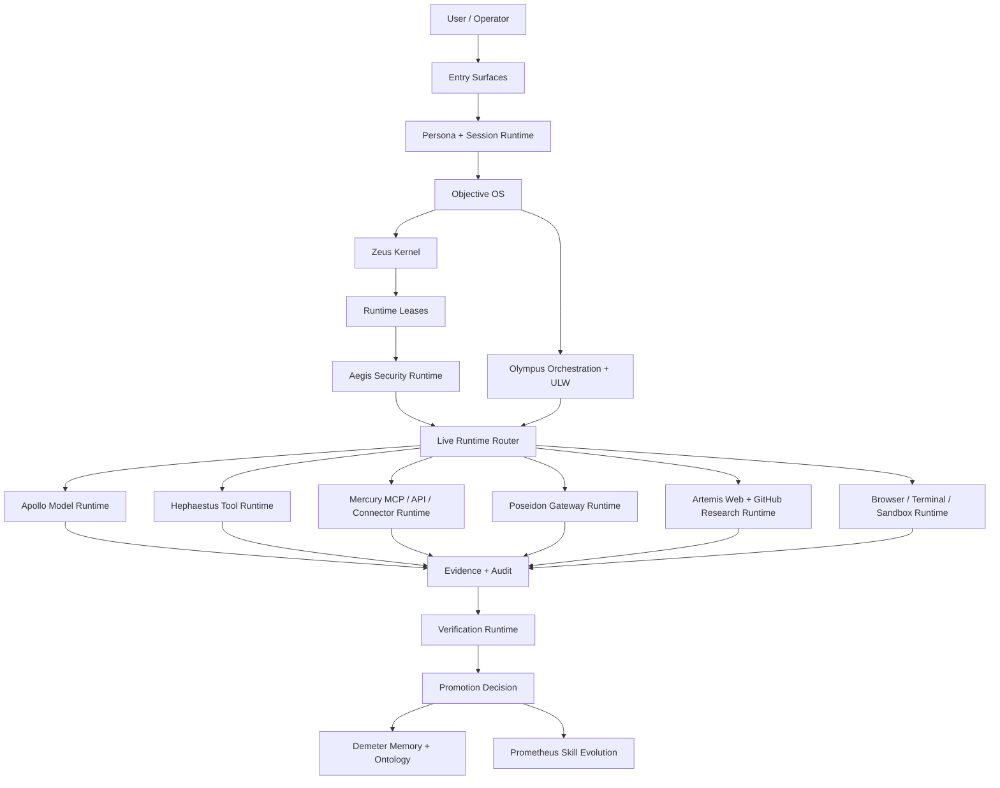

# Hermes-Grade Zeus Platform Master Design

This document defines the target design for growing Zeus from the current
governed runtime foundation into a Hermes-grade live agent platform.

It is intentionally not an implementation-complete claim. It is the product,
architecture, UX, security, and roadmap contract that future implementation
waves should satisfy before Zeus can claim Hermes-scale breadth.

## Scope

This document governs the target design for Hermes-grade platform absorption.
It does not replace the current v1.0.0-rc.3 implementation boundary. It defines the
future product and architecture standard for entry surfaces, persona, objective
control, provider runtime, MCP, tools, gateway, memory, skills, security,
observability, and release readiness.

This document changes product design language and roadmap expectations. It does
not claim that the listed live surfaces are already production-active.
Hermes remains upstream/reference only. Mercury is the Zeus internal transport product name for transport, connector, MCP, API, and gateway routing.

## Canonical Terms

| Term | Meaning | Source / Authority | Rejected aliases |
| --- | --- | --- | --- |
| Zeus Kernel | The authority, objective, evidence, and verification center that prevents the agent loop from granting itself power. | `src/zeus_agent/kernel/`, `src/zeus_agent/objective_runtime/`, `src/zeus_agent/verification_runtime/` | generic agent loop, Hermes Runtime |
| Athena | The objective reasoning and contract layer. | `src/zeus_agent/objective_runtime/` | prompt prefix |
| Thunderbolt | Runtime lease, capability authority, and dispatch grant boundary. | `src/zeus_agent/runtime_lease/` | blanket permission |
| Aegis | Security, approval, lease, sandbox, and fail-closed policy layer. | `src/zeus_agent/security/` | YOLO mode, implicit approval |
| Mercury | Transport, connector, MCP, API, and gateway routing product name. | `src/zeus_agent/transport_runtime/`, `src/zeus_agent/connector_runtime/`, `src/zeus_agent/mcp_runtime/` | Hermes Transport, hermes_transport |
| Apollo | Model/provider/inference/eval runtime. | `src/zeus_agent/model_runtime/` | raw provider wrapper |
| Hephaestus | Native tool runtime and build/execution adapter layer. | `src/zeus_agent/tool_runtime/`, `src/zeus_agent/tool_sandbox_runtime/` | uncontrolled tool executor |
| Poseidon | Gateway, external delivery, and surface containment runtime. | `src/zeus_agent/gateway_runtime/` | open public bot |
| Artemis | Research, web, GitHub, source pin, and citation evidence runtime. | `src/zeus_agent/research_runtime/`, `src/zeus_agent/web_runtime/`, `src/zeus_agent/github_runtime/` | loose web summary |
| Demeter | Durable state, memory, ontology, and local knowledge growth layer. | `src/zeus_agent/state/`, `src/zeus_agent/ontology_runtime/` | unscoped memory |
| Olympus | Orchestration, work-loop coordination, DAG, and ULW scheduling layer. | `src/zeus_agent/orchestration_runtime/`, `src/zeus_agent/workloop_runtime/` | many agents without ownership |
| Prometheus | Skill evolution, reviewed self-improvement, and controlled promotion layer. | `src/zeus_agent/skill_evolution/` | auto-promoted skill |
| Hermes-half target | A capability breadth target that requires at least half of Hermes's practical live platform mass, not empty LOC growth. | This document | line-count padding |
| Objective OS | The contract compiler, task DAG, ULW loop, recovery, review, and completion arbitration layer that turns a flexible goal into controlled progress. | This document | one-shot task prompt |
| Zeus persona | The named product identity and response contract that makes Zeus feel live, decisive, bounded, and objective-aware. | This document | generic assistant voice |

## Entities

| Entity | Identity | Ownership | Notes |
| --- | --- | --- | --- |
| User / Operator | Person setting objectives, constraints, approvals, and trust boundaries | Human | Zeus must not infer permanent authority from a one-time objective. |
| Zeus session | Conversation, profile, memory scope, active objective, and tool state | Persona + session runtime | Must survive across CLI, API, gateway, and library surfaces. |
| Objective contract | Accepted goal, constraints, non-goals, authority, budget, and evidence obligations | Athena + Zeus Kernel | Completion is invalid without this contract or an equivalent explicit run spec. |
| Runtime lease | Time, budget, path, network, credential, and capability grant | Thunderbolt + Aegis | Live runtime dispatch requires a matching lease. |
| Live adapter | Provider, MCP, tool, browser, terminal, gateway, web, or sandbox backend | Mercury + owning runtime | Must not bypass lease, approval, audit, or verification. |
| Memory record | User/project/session/objective/tool/skill knowledge item | Demeter | Must be local-first, scoped, and reviewable. |
| Skill proposal | Candidate reusable workflow or capability | Prometheus | Cannot self-promote or widen authority. |
| Evidence record | Proof of execution, block, review, citation, cleanup, or completion | Verification runtime | Required before completion or promotion. |

## States

| State | Meaning | Allowed transitions |
| --- | --- | --- |
| target_design | This document describes required future behavior, not implemented production status. | target_design -> planned_wave |
| planned_wave | A bounded implementation wave has accepted part of this target. | planned_wave -> implemented_dry_run, planned_wave -> blocked |
| implemented_dry_run | The surface exists as deterministic local planning/eval behavior only. | implemented_dry_run -> live_beta after live opt-in evidence |
| live_beta | A live adapter works under explicit lease, approval, sandbox, audit, and smoke evidence. | live_beta -> production_ready after security and release review |
| production_ready | The surface can be publicly claimed as live. | production_ready -> deprecated or rolled_back |
| blocked | A claim, live path, or promotion failed required authority/evidence/security checks. | blocked -> planned_wave after the missing condition is fixed |

## Invariants

- Zeus must absorb Hermes breadth without becoming a thin Hermes wrapper.
- Goal orientation must never imply unrestricted execution authority.
- Persona is part of the product contract, not decoration.
- Live surfaces must remain target or dry-run until evidence proves live
  execution under lease, approval, sandbox, audit, and verification.
- Memory and skill evolution must not widen authority without review.
- Completion requires evidence tied to the accepted objective.
- Code-size goals are capability guards, not incentives for bloat.

## Open Questions

- Which first live gateway adapters should ship before the Hermes-half release:
  Telegram, Discord, Slack, webhook, email, or another ordering?
- Which provider catalog should be the default first-run path: local LLM first,
  OpenAI-compatible first, or Nous/OpenRouter first?
- Which memory backend should be default for non-technical users: SQLite only,
  SQLite plus Markdown curation, or pluggable memory providers from the start?
- Which UI surface becomes the canonical objective cockpit: CLI/TUI first,
  local web dashboard first, or both in the same release wave?

## Baseline

Current Zeus is no longer a single-layer local agent. The local source tree has
these concrete anchors:

- `src/zeus_agent`: 729 Python files, 74,016 source lines, 64,512 non-comment
  Python LOC.
- `tests`: 288 Python test files, 38,886 source lines, 31,666 non-comment
  Python LOC.
- `docs`: 8 public documents, 2,854 lines.
- Source CLI registration: 224 deterministic commands when run from the source
  checkout with `PYTHONPATH=src`.
- Current deterministic architecture checks: `total-eval` 9/9 and
  `final-eval` 10/10.

The Hermes reference is substantially larger and already live. A local shallow
clone of `NousResearch/hermes-agent` at commit `3c163cb` measured the Hermes
core runtime aggregate at:

- 1,499 core runtime files.
- 595,327 core runtime source lines.
- 540 core Python files.
- 324,243 non-comment core Python LOC.

The half-Hermes target should not mean empty line-count inflation. It should
mean at least half of Hermes's practical live platform breadth: entry points,
providers, tools, MCP, gateway, memory, skills, cron, API/library surfaces,
sandboxes, tests, docs, and product UX.

## Product Thesis

Hermes's emotional value is:

```text
The agent that grows with you.
```

Zeus's emotional value must be different:

```text
The agent that turns your objective into controlled progress.
```

Goal orientation is not automatically destructive. It becomes destructive when
an agent treats a goal as permission to bypass consent, context, judgment, and
reversibility. Zeus must avoid that failure mode by making every objective
bounded, inspectable, interruptible, and evidence-backed.

The user should feel this:

- Zeus understands the objective, not just the last message.
- Zeus asks only the questions that change execution.
- Zeus turns the goal into a work plan, leases, tools, checks, and evidence.
- Zeus pushes through long work loops without losing direction.
- Zeus explains security and safety exposure before asking for approval.
- Zeus does not confuse momentum with permission.
- Zeus can be broad like Hermes while remaining purpose-bound.

The product promise is:

```text
Hermes stays with you.
Zeus moves the objective forward with you.
```

## Persona And UX Contract

Hermes has a strong first-person identity. Zeus needs one too. The persona is
not decoration; it affects trust, continuity, and the user's sense that the
agent is a live product rather than a library.

### Zeus Persona

Zeus should speak as a decisive but bounded operator:

- direct;
- goal-aware;
- calm under uncertainty;
- transparent about risk;
- explicit about required approvals;
- unwilling to claim completion without evidence;
- not theatrical;
- not a generic chat assistant.

Example first-touch responses:

```text
Zeus is here. State the objective and the constraints.
```

```text
Understood. I will turn this into an objective contract, identify the required
live surfaces, and ask for approval only where authority changes.
```

```text
I can proceed. Before live execution, these are the exposed surfaces: provider
API, GitHub search, local terminal, and MCP filesystem. Terminal mutation and
external delivery need approval.
```

Korean UX can keep the same contract:

```text
제우스입니다. 목적과 제한 조건을 알려주세요.
```

```text
이 목적은 진행할 수 있습니다. 실행 전에 필요한 권한, 보안 노출, 검증 기준을 먼저 정리하겠습니다.
```

### Core Product Modes

| Mode | User feeling | Required product behavior |
| --- | --- | --- |
| `zeus chat` | I can talk to Zeus naturally | Persona, memory, provider routing, tools, session continuity |
| `zeus objective` | Zeus understands what outcome matters | Deep interview, objective contract, constraints, evidence obligations |
| `zeus work` | Zeus keeps pushing the work forward | ULW loop, checkpoints, task DAG, recovery, review |
| `zeus live` | Zeus can use external systems safely | Provider/MCP/tool/web/gateway/sandbox leases and approvals |
| `zeus remember` | Zeus can retain useful context | Memory, ontology, user/project model, retention controls |
| `zeus improve` | Zeus can learn better workflows | Skill proposals, evals, review, controlled promotion |
| `zeus status` | I can inspect what Zeus is doing | Objective state, active leases, running jobs, evidence, risks |
| `zeus doctor` | I can fix setup problems | Provider, MCP, gateway, sandbox, secrets, filesystem diagnostics |

## Target Architecture



The key distinction from Hermes remains:

- Hermes centers a broad `AIAgent`.
- Zeus centers objective authority and evidence.

But the target Zeus platform still needs Hermes-like breadth. Objective control
must not shrink the user-facing platform.

## Entry Surfaces

Zeus needs multiple first-class entry points, not only deterministic eval CLI
commands.

| Surface | Target |
| --- | --- |
| Interactive CLI/TUI | `zeus`, `zeus chat`, slash commands, streaming output, approvals, interrupts |
| Setup wizard | Provider keys, local LLM, MCP catalog, sandbox backend, gateway pairing |
| Python library | `from zeus_agent import ZeusAgent`, objective/session/work APIs |
| HTTP API server | OpenAI-compatible chat, objective API, run status, webhooks |
| Gateway daemon | Telegram, Discord, Slack, webhook, email first; extensible adapters later |
| ACP/editor adapter | VS Code, Zed, JetBrains compatible editor agent surface |
| Batch runner | dataset prompts, objective runs, trajectory export, eval harness |
| Cron/automation | scheduled objectives, standing orders, approval-aware headless mode |
| Web dashboard | objective cockpit, sessions, memory, tools, active leases, audit |

Minimum Hermes-half target:

- 8 entry surfaces implemented or beta-quality.
- 5 user-facing surfaces usable without editing Python.
- all live surfaces pass lease, approval, sandbox, audit, and verification gates.

## Objective OS

The objective layer is Zeus's differentiator. It should not be a thin prompt
prefix. It should be an operating model.

Required modules:

- deep interview runtime for unclear objectives;
- objective contract compiler;
- constraint and forbidden-action parser;
- success criteria and evidence planner;
- task DAG builder;
- ULW loop runner;
- recovery planner;
- review planner;
- completion arbiter.

A valid objective contract must contain:

- objective statement;
- user value;
- non-goals;
- constraints;
- authority boundaries;
- required live surfaces;
- success criteria;
- verification obligations;
- rollback or recovery path;
- memory/write policy;
- approval policy;
- budget and TTL.

The objective contract is why Zeus can be more impactful than a generic agent:
it can keep working across sessions without forgetting what "done" means.

## Live Runtime Breadth

### Provider Runtime

Target provider support:

- local deterministic provider;
- Ollama/local OpenAI-compatible server;
- OpenAI-compatible remote endpoints;
- Anthropic Messages-style provider;
- OpenRouter/Nous Portal-style routing;
- Gemini-compatible metadata path;
- provider fallback chains;
- credential pools;
- model switching;
- token/latency/cost evidence;
- provider health probes.

Minimum Hermes-half target:

- 10 provider profiles.
- 3 API modes.
- setup wizard support.
- fallback and retry policy.
- local LLM path.

### MCP Runtime

Hermes supports local stdio and remote HTTP MCP servers, startup discovery,
per-server filtering, utility wrappers, OAuth paths, and catalog entries.
Zeus should absorb that breadth but add stronger authority boundaries.

Target MCP features:

- stdio MCP servers;
- HTTP MCP servers;
- OAuth and token storage;
- server manifest and provenance checks;
- curated catalog;
- install/enable/disable/configure commands;
- include/exclude filtering;
- resource and prompt wrapper defaults;
- dynamic tool refresh;
- schema redaction;
- prompt-injection scan on tool descriptions;
- per-tool side-effect classification.

Minimum Hermes-half target:

- 10 curated MCP catalog entries.
- stdio and HTTP support.
- OAuth-ready remote server flow.
- tool include/exclude policy.
- resources/prompts default off unless explicitly enabled.

### Tool Runtime

Target tool families:

- file read/write/patch/search;
- terminal;
- code execution;
- browser automation;
- web search and extract;
- GitHub repo/issues/PR/search;
- package documentation lookup;
- data/query tools;
- image/vision;
- subagent delegation;
- message delivery;
- memory and ontology tools;
- eval and benchmark tools.

Minimum Hermes-half target:

- 40 native tools.
- 15 toolsets.
- all tools have schema, risk class, side-effect class, authority requirements,
  evidence output, and no-secret-echo coverage.

### Terminal, Browser, Web, And Sandbox

Target backends:

- local dry-run;
- local restricted;
- Docker;
- SSH remote;
- hosted sandbox provider;
- browser automation backend;
- web search provider;
- web extraction provider;
- GitHub search provider.

Default posture:

- network egress deny unless leased;
- filesystem mounts deny unless granted;
- destructive commands require approval;
- Docker socket blocked by default;
- browser local-network access blocked by default;
- all live commands produce cleanup evidence.

Minimum Hermes-half target:

- 3 terminal/sandbox backends.
- 2 browser backends.
- 3 web/research providers.
- one remote runtime path.

### Gateway And Messaging

Hermes's gateway is one of its strongest live-platform features. Zeus needs a
gateway, but with stronger objective and authority context.

Target gateway features:

- long-running daemon;
- loopback-first API;
- authenticated external API adapter;
- Telegram;
- Discord;
- Slack;
- webhook;
- email;
- pairing;
- allowlists;
- session isolation;
- idempotency;
- delivery target scopes;
- `/approve`, `/deny`, `/status`, `/stop`, `/new`, `/objective`;
- cron delivery;
- evidence and audit tail.

Minimum Hermes-half target:

- 5 gateway adapters.
- daemon lifecycle commands.
- pairing and allowlist.
- external delivery approval gate.
- session persistence and recovery.

## Memory, Ontology, And Growth

Hermes's strength is that it grows with the user. Zeus must grow too, but it
should grow in a way that makes objectives easier to complete.

Target memory layers:

- session memory;
- project memory;
- user preference memory;
- objective memory;
- tool outcome memory;
- workflow memory;
- ontology candidate memory;
- skill proposal memory;
- audit memory.

Storage policy:

- JSONL for append-only event/audit/evidence streams;
- SQLite for queryable sessions, run state, tool calls, leases, and FTS search;
- Markdown for curated human-readable skills, runbooks, and project notes;
- YAML or TOML for user-editable config;
- JSON for machine-readable manifests.

Security policy:

- memory is local-first by default;
- raw secrets never enter memory;
- PII and sensitive user facts are retention-scoped;
- cross-session recall requires explicit scope;
- memory writes are reviewable;
- ontology promotion requires provenance and review.

The Demeter layer should become the place where Zeus builds a durable model of:

- the user's goals;
- the user's constraints;
- recurring workflows;
- project architecture;
- trusted tools;
- common failure modes;
- better objective templates;
- reusable skills.

## Skill Evolution

Prometheus should absorb Hermes-style skill growth and SkillOpt-style
optimization without allowing self-promotion.

Target features:

- skill proposal generation from repeated work;
- failure clustering;
- successful workflow distillation;
- skill eval generation;
- skill regression tests;
- sandboxed skill trial;
- user review;
- signed promotion;
- rollback;
- deprecation.

Minimum Hermes-half target:

- installed skill directory;
- optional skill catalog;
- skill execution runtime;
- skill authoring command;
- skill eval command;
- memory-to-skill proposal path;
- review gate before activation.

## Observability And Evaluation

Hermes has visible execution and trajectory export. Zeus needs stronger
evidence.

Required observability:

- span traces per objective;
- tool-call timeline;
- provider-call evidence;
- lease audit;
- approval receipt;
- secret-redaction audit;
- sandbox cleanup evidence;
- gateway delivery audit;
- source citation graph;
- objective completion report;
- regression and eval score.

Target eval surfaces:

- provider eval;
- tool eval;
- MCP eval;
- gateway eval;
- sandbox eval;
- browser eval;
- web research eval;
- memory eval;
- skill eval;
- orchestration eval;
- end-to-end objective eval;
- adversarial security eval.

Minimum Hermes-half target:

- 600+ tests.
- 100+ integration/eval scenarios.
- deterministic dry-run CI.
- live smoke suite that can run only with explicit opt-in.

## Security Architecture

Zeus's safety must be useful, not UX-hostile. The security layer should not
make normal work feel impossible. It should explain risk at the moment the
objective needs authority.

Required security runtimes:

- identity runtime;
- approval runtime;
- secret runtime;
- MCP security runtime;
- gateway security runtime;
- sandbox runtime;
- plugin supply-chain runtime;
- memory privacy runtime;
- automation security runtime;
- audit runtime.

Human approval prompts should include:

- requested action;
- objective linkage;
- live surface;
- credential/path/network scope;
- possible damage;
- mitigation;
- rollback path;
- exact authority duration;
- approve/deny/always-deny/approve-once choices.

Zeus should never ask:

```text
Can I proceed?
```

without explaining what the user is actually approving.

## Code Size And Capability Targets

The target is "at least half Hermes-grade" in useful platform mass.

| Metric | Current Zeus | Hermes core reference | Zeus Hermes-half target |
| --- | ---: | ---: | ---: |
| Runtime files | 729 | 1,499 | 700+ useful runtime files |
| Python LOC | 64,512 | 324,243 | 120k-170k useful runtime LOC |
| Test files | 288 | 1,410 | 500+ test/integration files |
| Docs lines | 2,854 | 436k+ full docs/reference | 30k+ practical product/developer docs |
| CLI/product commands | 224 deterministic commands | broad `hermes` CLI/gateway/API/library | 100+ user/product commands |
| Native tools | scaffolded | 70+ tools | 40+ tools |
| Toolsets | scaffolded | ~28 toolsets | 15+ toolsets |
| Gateway adapters | loopback/API scaffold | 20 platform adapters | 5+ adapters |
| Provider profiles | scaffolded | 18+ provider paths | 10+ profiles |
| MCP catalog | scaffolded | curated optional MCPs | 10+ entries |

The LOC target is a planning guard, not a reason to add bloat. A smaller Zeus
can pass if it reaches the same live capability breadth with cleaner code and
stronger tests.

## Absorption Map

| Hermes capability | Zeus target owner | Zeus difference |
| --- | --- | --- |
| `AIAgent` conversation loop | Persona + Objective OS + agent runtime | Conversation is objective-bound and evidence-backed |
| CLI | CLI/TUI runtime | Persona, setup, live commands, objective cockpit |
| Gateway | Poseidon | Delivery is scoped by session, target, approval, and audit |
| ACP | Editor adapter runtime | Coding objectives get write-scope and evidence contracts |
| API server | API runtime | OpenAI-compatible chat plus objective/run APIs |
| Python library | Library surface | Programmatic objective contracts and run lifecycle |
| Provider resolver | Apollo | Provider calls require lease, budget, evidence |
| Tool registry | Hephaestus | Tool visibility depends on authority and side effects |
| MCP | Mercury | MCP servers are supply-chain and authority boundaries |
| Terminal/browser/web | Sandbox + Artemis | Execution is sandboxed, leased, cited, and verified |
| Memory | Demeter | Memory is local-first, scoped, reviewable, and ontology-aware |
| Skills | Prometheus | Skills can propose and improve but cannot self-promote |
| Cron | Workflow runtime | Headless work cannot bypass approval or authority |
| Batch/trajectory | Eval/runtime analytics | Trajectories become eval and self-improvement inputs |
| Plugins | Plugin runtime | Manifests, signatures/hashes, dependency gates, quarantine |

## Roadmap

### Wave A: Product Shell And Persona

Deliver:

- `zeus` interactive CLI/TUI;
- persona prompt and response contract;
- setup wizard;
- `zeus chat`;
- `zeus objective`;
- `zeus status`;
- persistent session profile;
- provider selection UI;
- first-run local LLM/OpenAI-compatible setup.

Exit criteria:

- user can call Zeus naturally;
- Zeus greets and answers as Zeus;
- session continuity works;
- objective creation works from chat;
- approvals can be surfaced in CLI.

### Wave B: Provider, Tool, MCP Breadth

Deliver:

- provider catalog;
- credential store;
- tool registry expansion;
- stdio/HTTP MCP runtime;
- MCP catalog;
- web/GitHub research tools;
- terminal sandbox backend;
- browser dry-run/live backend.

Exit criteria:

- 10 provider profiles;
- 40 tools;
- 10 MCP entries;
- live opt-in smoke suite;
- no secret echo;
- external tools hidden unless leased.

### Wave C: Gateway, API, Library, ACP

Deliver:

- HTTP API server;
- Python library;
- long-running gateway daemon;
- first 5 gateway adapters;
- ACP/editor adapter;
- webhook ingress;
- delivery target scopes.

Exit criteria:

- Zeus can be used outside the terminal;
- gateway sessions preserve identity and objective state;
- API and Python library share the same runtime contracts;
- editor/coding integration has write-scope evidence.

### Wave D: Memory, Ontology, Skills

Deliver:

- memory providers;
- ontology candidate store;
- cross-session search;
- skill authoring;
- skill eval;
- skill promotion gate;
- workflow distillation.

Exit criteria:

- Zeus remembers useful context safely;
- repeated workflows become proposed skills;
- no memory or skill can widen authority without review.

### Wave E: Orchestration And ULW Live Work

Deliver:

- task DAG;
- parallel worker runtime;
- disjoint write-scope scheduler;
- worker evidence bundles;
- orchestrator integration tests;
- independent review runtime;
- recovery and retry policies.

Exit criteria:

- Zeus can run multiple coding/research/tool tasks in parallel;
- conflicts block before execution;
- every worker produces evidence;
- orchestrator review decides completion.

### Wave F: Hermes-Half Release Candidate

Deliver:

- 700+ useful runtime files or equivalent capability breadth;
- 120k-170k useful runtime LOC or justified lower equivalent;
- 500+ test/integration files;
- 100+ eval scenarios;
- 8 entry surfaces;
- 5 gateway adapters;
- 10 providers;
- 40 tools;
- 15 toolsets;
- 10 MCP entries;
- production-safe security and release gates.

Exit criteria:

- Zeus can honestly claim Hermes-grade direction and at least Hermes-half live
  platform breadth;
- public docs no longer describe live surfaces as only dry-run/future;
- release evidence proves live provider/MCP/tool/gateway/web/sandbox paths
  under Zeus authority.

## Final Architecture Boundary

Zeus should absorb Hermes breadth, not Hermes shape.

The final product should feel like:

- a real named AI persona;
- a general-purpose live agent platform;
- a persistent personal/project agent;
- a coding and research operator;
- a workflow builder;
- a self-improving system;
- a governed objective executor.

The final product should not become:

- a thin wrapper around Hermes;
- an agent loop that grants itself authority;
- a security policy that blocks ordinary UX;
- a command runner with a mythological name;
- a documentation-only architecture.

Zeus wins only if the user can feel both sides at once:

```text
It is alive and broad enough to use like Hermes.
It is disciplined enough to drive my objective to evidence-backed completion.
```

## Source Notes

- Hermes architecture:
  <https://hermes-agent.nousresearch.com/docs/developer-guide/architecture>
- Hermes MCP:
  <https://hermes-agent.nousresearch.com/docs/user-guide/features/mcp>
- Hermes skills:
  <https://hermes-agent.nousresearch.com/docs/user-guide/features/skills>
- Hermes security:
  <https://hermes-agent.nousresearch.com/docs/user-guide/security>
- Hermes Python library:
  <https://hermes-agent.nousresearch.com/docs/guides/python-library>
- Zeus current comparison:
  <./hermes-comparison.md>
- Zeus live connection design:
  <./live-connection-architecture.md>
