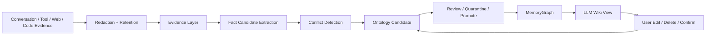
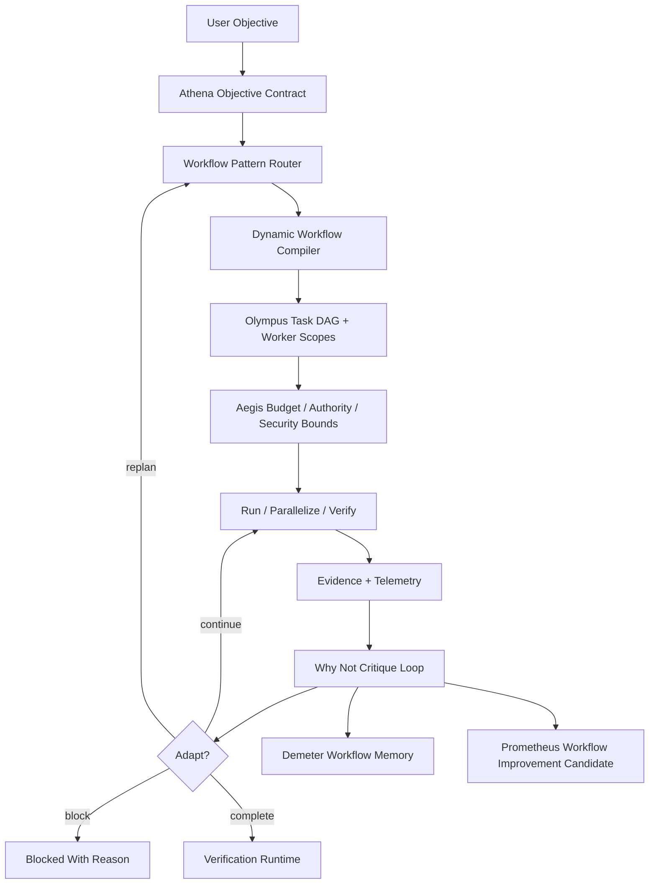

# Hermes Live Platform Absorption Master Plan

This document defines the full-scale design for absorbing Hermes Agent's live
platform breadth into Zeus while preserving Zeus's product center: objective
control, runtime authority, evidence, security, and controlled self-improvement.

It is a design and implementation target, not a claim that all listed live
surfaces are already production-active.

## Scope

This document governs the next full-scale architecture target for Zeus live
platform absorption. It extends, but does not replace:

- `docs/hermes-grade-platform-master-design.md`;
- `docs/hermes-comparison.md`;
- `docs/live-connection-architecture.md`.

The scope includes live entry surfaces, provider runtime, MCP, tools, gateway,
API server, Python library, sessions, MemoryGraph, LLM Wiki, skill evolution,
parallel ULW, adaptive workflow intelligence, security, plugin runtime,
migration, scale targets, and release gates.

The scope does not claim that the current checkout already implements every live
surface described here. Each surface remains target, dry-run, beta, or
production-ready according to the implementation evidence produced later.
The public v4.0.0 boundary remains governed local-first:
designed/prepared/dry-run/future for production live-capable surfaces unless a
specific surface has separate production evidence and release approval. The
implemented boundary includes live-beta-candidate and production-foundation
contracts for local smoke, readiness, identity/auth, approval, lease,
credential, secret, audit, sandbox, rollback, and review evidence; Provider
Live API loopback smoke; MCP Live Server loopback smoke and prompt-injection
scanning; Gateway Live Delivery loopback smoke and target allowlists; Sandbox
Terminal local command smoke and browser/network/Docker/SSH guards; Memory
Privacy Live, Provider Live Opt-in, Provider Owned Client Live, MCP Owned
Client Live, Stable Release reporting, local SQLite MemoryGraph privacy, secret
quarantine, retention deletion, cross-session search default-deny, and
no-auto-promotion evidence.

Zeus is the canonical product identity. Hermes remains upstream/reference only.
Mercury is the Zeus internal transport product name for transport, connector,
MCP, API, and gateway routing.

## Canonical Terms

| Term | Meaning | Rejected aliases |
| --- | --- | --- |
| Zeus Kernel | The authority, objective, evidence, and verification center that prevents the agent loop from granting itself power. | all-powerful agent loop, global YOLO |
| Athena | Objective reasoning and contract compilation layer. | prompt prefix, task title |
| Thunderbolt | Runtime lease and capability grant boundary. | permission flag, allow all |
| Aegis | Security, approval, sandbox, privacy, and fail-closed policy layer. | optional safety layer |
| Mercury | Transport, MCP, API, connector, and routing product layer. | Hermes transport, raw connector |
| Apollo | Model, provider, inference, fallback, and provider evidence runtime. | raw SDK wrapper |
| Hephaestus | Native tool runtime, toolsets, schemas, dispatch, and execution adapter layer. | uncontrolled tool executor |
| Poseidon | Gateway, external delivery, platform adapter, and delivery containment runtime. | open public bot |
| Artemis | Web, GitHub, docs, source pins, and research evidence runtime. | loose web summary |
| Demeter | Durable memory, MemoryGraph, ontology, LLM Wiki, retention, and local knowledge growth. | unscoped memory dump |
| Olympus | Parallel orchestration, ULW loop, task DAG, write scopes, recovery, and worker evidence. | more agents without ownership |
| Prometheus | Skill evolution, reviewed self-improvement, eval, and controlled promotion. | auto-promoted skill |
| Hermes reference breadth | The practical breadth signal Zeus studies from Hermes Agent: CLI, gateway, providers, tools, MCP, sessions, memory, skills, cron, API, ACP, batch, and library surfaces. | product identity, Zeus runtime name |
| Zeus live platform | Broad live capability routed through Zeus objective authority, leases, security, evidence, and verification. | Hermes clone, generic agent wrapper |
| MemoryGraph | Evidence-grounded schema/fact/passage graph used by Demeter. | vector-only memory, raw chat log |
| LLM Wiki | Human-readable curation view over MemoryGraph. | source of truth, unchecked generated docs |
| Adaptive Workflow Intelligence | Zeus's ability to choose, compose, critique, and revise work patterns while staying inside authority, budget, evidence, and security boundaries. | uncontrolled self-optimization |
| Dynamic Workflow Compiler | Olympus component that turns an objective into a pattern plan, task graph, worker scopes, verification obligations, and stop conditions. | ad hoc agent spawning |
| Workflow Pattern Router | Classifier that selects `classify-and-act`, `fan-out-and-synthesize`, `adversarial-verification`, `generate-and-filter`, `tournament`, `loop-until-done`, or a composed pattern. | one fixed ULW loop |
| Why Not Critique Loop | Runtime review checkpoint where Zeus asks whether the current workflow is still the best way to reach the objective. | unbounded second guessing |
| Workflow Improvement Candidate | Evidence-backed proposal to change future workflow defaults, stored through Demeter and reviewed through Prometheus. | automatic rule rewrite |
| Platform breadth target | Capability and UX breadth target comparable to practical live agent platform mass. | line-count padding |

## Entities

| Entity | Owner | Notes |
| --- | --- | --- |
| User / Operator | Human | Sets objectives, constraints, approvals, memory scope, and trust boundaries. |
| Zeus session | Persona + session runtime | Conversation, profile, objective state, memory scope, and active tools. |
| Objective contract | Athena + Zeus Kernel | Accepted goal, constraints, non-goals, budget, authority, evidence obligations. |
| Runtime lease | Thunderbolt + Aegis | Time, capability, path, network, credential, tool, MCP, gateway, and memory grant. |
| Live adapter | Owning runtime | Provider, MCP, tool, gateway, API, browser, terminal, sandbox, or web backend. |
| Evidence record | Verification runtime | Proof of execution, citation, audit, block, review, cleanup, or completion. |
| Memory fact | Demeter | Scoped fact with provenance, freshness, retention, and conflict state. |
| Wiki page | Demeter wiki runtime | Editable human-readable view, not the source of truth. |
| Skill proposal | Prometheus | Candidate workflow or capability that cannot self-promote. |
| Dynamic workflow plan | Olympus | Pattern choice, task graph, worker scopes, verification plan, budget, stop condition, and adaptation triggers. |
| Workflow critique checkpoint | Olympus + Verification runtime | Evidence-backed decision to continue, replan, compress, fan out, verify adversarially, switch to lean mode, or stop. |
| Gateway client | Poseidon | Platform, channel, user, role, and delivery target identity. |
| Plugin | Plugin runtime | Manifested extension with permissions, hooks, tools, and supply-chain evidence. |

## States

| State | Meaning | Allowed transitions |
| --- | --- | --- |
| `target_design` | Architecture is described but not implemented. | `target_design -> planned_wave` |
| `planned_wave` | A bounded implementation wave accepts part of the target. | `planned_wave -> dry_run`, `planned_wave -> blocked` |
| `dry_run` | Deterministic local behavior exists without real external side effects. | `dry_run -> live_beta`, `dry_run -> blocked` |
| `live_beta` | Live execution works under explicit lease, approval, sandbox, and evidence. | `live_beta -> production_ready`, `live_beta -> rolled_back` |
| `production_ready` | Surface can be publicly claimed as live. | `production_ready -> deprecated`, `production_ready -> rolled_back` |
| `quarantined` | Memory, MCP server, plugin, skill, or tool is visible for review but inactive. | `quarantined -> rejected`, `quarantined -> promoted_with_review` |
| `workflow_compiled` | Olympus has selected a dynamic workflow pattern and produced a bounded plan. | `workflow_compiled -> dry_run`, `workflow_compiled -> live_beta`, `workflow_compiled -> blocked` |
| `workflow_adapting` | Zeus has detected a workflow bottleneck, drift, inefficiency, or verification failure and is revising the plan. | `workflow_adapting -> workflow_compiled`, `workflow_adapting -> blocked` |
| `blocked` | Required authority, security, evidence, or review is missing. | `blocked -> planned_wave` after missing condition is fixed |

## Invariants

- Zeus must absorb Hermes breadth without becoming a thin Hermes wrapper.
- Basic chat must remain light even when the internal architecture is deep.
- The agent loop cannot grant itself live authority.
- Tool visibility is not execution authorization.
- Live provider, MCP, API, gateway, browser, terminal, sandbox, plugin, and cron
  execution require a matching runtime lease.
- MemoryGraph facts require provenance and retention scope before promotion.
- LLM Wiki pages are curation surfaces, not primary truth.
- Skill evolution can propose improvements but cannot widen authority or
  self-promote.
- Adaptive workflow intelligence can improve execution strategy but cannot
  expand runtime authority, credential scope, network access, file scope,
  gateway delivery, or budget by itself.
- Zeus should avoid self-imposed performance ceilings, but must keep explicit
  safety, cost, approval, and evidence ceilings.
- Completion claims require evidence tied to the accepted objective.
- Code-size targets are capability guards, not incentives for bloat.

## Open Questions

- Should Zeus parity target aim for 12 gateway adapters first, or go directly to
  20+ adapters before the first parity release?
- Should first-run setup default to local LLM, OpenAI-compatible endpoint,
  OpenRouter, or an explicit provider picker?
- Should MemoryGraph use SQLite-only graph tables first, or add a vector index
  in the same wave?
- Should the first public dashboard be a local web UI, terminal TUI, or both?
- Which Hermes import surfaces should be enabled by default: config only,
  config plus MCP, or config plus sessions/memory/skills as quarantined
  candidates?

## Executive Decision

Zeus should catch up to Hermes in practical live platform mass, but it should
not copy Hermes's shape.

Hermes centers one broad `AIAgent` that serves CLI, gateway, ACP, batch, API,
and Python library surfaces. Zeus should expose the same breadth to users, but
the live runtime must pass through Zeus Kernel, runtime leases, security
planning, evidence, and verification before it can act.

The product rule is:

```text
Start as lightly as Hermes. Finish with Zeus-grade objective control.
```

For a Hermes user, Zeus must feel simple at first touch:

```bash
zeus chat
zeus model set openrouter/qwen
zeus mcp add github
zeus tools
zeus remember
zeus work "ship this repo change"
```

The heavy layers must remain behind profiles and activation gates. The user
should not need to understand ontology, leases, evidence maps, or promotion
controls until the task actually needs them.

## Source Baseline

This plan uses Hermes official documentation as the live-platform baseline:

- Architecture: <https://hermes-agent.nousresearch.com/docs/developer-guide/architecture/>
- Tools runtime: <https://hermes-agent.nousresearch.com/docs/developer-guide/tools-runtime/>
- MCP: <https://hermes-agent.nousresearch.com/docs/user-guide/features/mcp/>
- Messaging gateway: <https://hermes-agent.nousresearch.com/docs/user-guide/messaging/>
- API server: <https://hermes-agent.nousresearch.com/docs/user-guide/features/api-server/>
- Sessions: <https://hermes-agent.nousresearch.com/docs/user-guide/sessions>
- Provider runtime: <https://hermes-agent.nousresearch.com/docs/developer-guide/provider-runtime>
- Python library: <https://hermes-agent.nousresearch.com/docs/guides/python-library>

It also uses Anthropic's dynamic workflow documentation as the adaptive
workflow baseline:

- Dynamic workflows: <https://claude.com/blog/a-harness-for-every-task-dynamic-workflows-in-claude-code>
- Agent loop: <https://code.claude.com/docs/en/agent-sdk/agent-loop>

Hermes official docs describe these practical live surfaces:

| Hermes surface | Live behavior Zeus should absorb |
| --- | --- |
| Shared agent core | One agent runtime serves CLI, gateway, ACP, batch, API, and library entry points. |
| Tools | Central registry, schema collection, dispatch, availability checks, error wrapping, 70+ registered tools, about 28 toolsets. |
| Terminal backends | Local, Docker, SSH, Daytona, Modal, and Singularity backends. |
| MCP | Local stdio and remote HTTP MCP servers, startup discovery, per-server filtering, optional parallel calls, resources/prompts when supported. |
| Sessions | SQLite state database with FTS5, cross-session search, session lineage, per-platform isolation, export/resume. |
| Messaging gateway | Long-running gateway, 20+ platform adapters, allowlists, DM pairing, slash commands, cron ticking, background maintenance. |
| API server | OpenAI-compatible chat completions, responses/runs APIs, streaming/progress, capabilities and health endpoints. |
| Providers | Runtime provider resolution, custom OpenAI-compatible endpoints, native provider paths, fallback providers. |
| Plugins | User/project/pip plugin discovery, tools, hooks, CLI commands, memory providers, context engines. |
| Cron | Agent tasks, not shell-only jobs, with delivery to configured platforms. |
| ACP | Editor-native agent surface over stdio/JSON-RPC. |
| Trajectories | Session export for training and evaluation. |

## Current Zeus Baseline

Measured in the public v4.0.0 release tree:

| Area | Current Zeus |
| --- | ---: |
| Public source/test/docs files | 1,086 |
| `src` Python source lines | 78,950 |
| `tests` Python source lines | 40,324 |
| `docs` Markdown lines | 2,966 |
| Python test files | 298 |
| Registered CLI commands | 234 |

Current Zeus already has many runtime anchors:

- `kernel`
- `objective_runtime`
- `runtime_lease`
- `security`
- `model_runtime`
- `tool_runtime`
- `mcp_runtime`
- `connector_runtime`
- `transport_runtime`
- `gateway_runtime`
- `workflow_runtime`
- `workloop_runtime`
- `orchestration_runtime`
- `research_runtime`
- `web_runtime`
- `github_runtime`
- `browser_runtime`
- `terminal_runtime`
- `sandbox_runtime`
- `state`
- `ontology_runtime`
- `skill_evolution`
- `observability_runtime`
- `verification_runtime`

The gap is not that Zeus has no structure. The gap is that most of the structure
is still deterministic, scaffolded, dry-run, or narrow. Hermes is live and
usable across many entry points. Zeus needs the same practical breadth.

## Target Scale

The user asked for a scale-up large enough to catch up in one strategic arc.
The target should be expressed as useful platform mass, not empty line padding.

| Metric | Current Zeus | Hermes reference signal | Zeus parity target |
| --- | ---: | ---: | ---: |
| Runtime Python LOC | 74.0k source / 64.5k non-comment | Hermes is materially larger and live | 180k-280k useful runtime LOC |
| Test LOC | 38.9k source / 31.7k non-comment | broad tests across agent/gateway/tools/providers | 120k+ test LOC |
| Runtime files | 729 Python modules in `src/zeus_agent` | broad multi-surface runtime | 700-1,000 useful runtime files |
| Test files | 288 | broad unit/integration/e2e coverage | 700+ test files |
| Product docs | 2.8k public docs lines | large public docs and references | 80k+ practical docs lines |
| Entry surfaces | CLI/eval/scaffolded API/gateway | CLI, gateway, ACP, batch, API, library | 8 production/beta surfaces |
| Providers | fake/local/OpenAI-compatible scaffolds | many provider paths and fallbacks | 15+ provider profiles |
| Native tools | scaffolded | 70+ tools | 80+ Zeus tools |
| Toolsets | scaffolded | about 28 toolsets | 25+ toolsets |
| Gateway adapters | loopback/API scaffolds | 20+ adapters | 12+ adapters initial, 20+ parity |
| MCP catalog | scaffolded | curated MCPs and custom add flow | 25+ catalog entries |
| Sandboxes | local/dry-run support | terminal backends and remote environments | local, Docker, SSH, remote, browser, job sandbox |

The parity target is intentionally high. It should be reached through real
runtime modules, adapters, tests, docs, and operational surfaces. A smaller
codebase can pass only if it reaches equal or better practical capability with
stronger tests and less duplication.

## Product Shape

Zeus must provide two simultaneous experiences.

### Light General Agent

This is the Zeus general-agent entry feeling:

- direct chat;
- model switching;
- MCP setup;
- tool use;
- session resume;
- memory recall;
- gateway delivery;
- file deliverables;
- background tasks;
- API-compatible serving.

The default user should not see internal control-plane language.

### Objective Operating System

This is what makes Zeus different:

- objective contract;
- authority scope;
- runtime lease;
- task DAG;
- ULW loop;
- parallel orchestration;
- security preflight;
- evidence capture;
- verification;
- memory and skill promotion;
- rollback and completion arbitration.

The objective layer activates when a task has meaningful side effects, long
duration, high ambiguity, external integrations, code changes, security risk, or
release claims.

## User-Facing Profiles

Profiles keep the platform broad without making basic use heavy.

| Profile | User intent | Active layers |
| --- | --- | --- |
| `chat` | Talk to Zeus like a general assistant | Persona, session, model, safe tools, memory read |
| `research` | Search web/GitHub/docs and synthesize | Artemis, source pins, citations, freshness checks |
| `work` | Make progress on a concrete objective | Athena, Olympus, task DAG, evidence, review |
| `live` | Use external systems | Mercury, Apollo, MCP/API/gateway leases, approvals |
| `code` | Edit and verify a repo | objective, write scopes, terminal/sandbox, tests, review |
| `strict` | Security, data, release, destructive work | Aegis, approvals, threat model, rollback, independent review |
| `remember` | Inspect or curate memory | Demeter, MemoryGraph, LLM Wiki, retention controls |
| `improve` | Propose better skills/workflows | Prometheus, evals, promotion review |

The default first-run profile should be `chat`. Zeus should escalate to `work`,
`live`, or `strict` only when the task demands it.

## Target Architecture

```mermaid
flowchart TB
    U["User / Gateway / API / Editor / Batch"] --> E["Entry Surface Runtime"]
    E --> P["Persona + Profile Runtime"]
    P --> S["Session Runtime"]
    S --> A["Athena Objective Runtime"]
    A --> K["Zeus Kernel"]
    K --> L["Thunderbolt Runtime Lease"]
    L --> X["Aegis Security + Approval"]
    X --> R["Live Runtime Router"]
    R --> M["Apollo Provider Runtime"]
    R --> T["Hephaestus Tool Runtime"]
    R --> C["Mercury MCP / API / Connector Runtime"]
    R --> G["Poseidon Gateway Runtime"]
    R --> W["Artemis Web / GitHub / Docs Runtime"]
    R --> B["Terminal / Browser / Sandbox Runtime"]
    R --> O["Olympus Orchestration Runtime"]
    M --> EV["Evidence + Audit"]
    T --> EV
    C --> EV
    G --> EV
    W --> EV
    B --> EV
    O --> EV
    EV --> V["Verification Runtime"]
    V --> D["Demeter MemoryGraph + LLM Wiki"]
    V --> PR["Prometheus Skill Evolution"]
    V --> OUT["Complete / Continue / Block / Roll Back"]
```



The agent loop asks for work. It does not grant itself authority. Live execution
requires an accepted profile, objective when needed, runtime lease, security
decision, and evidence target.

## Runtime Ownership Map

| Runtime | New responsibility required for Hermes-scale absorption |
| --- | --- |
| `entry_runtime` | Interactive CLI/TUI, setup wizard, command groups, shell completion, persona shell, profile picker. |
| `session_runtime` | SQLite+FTS5 sessions, lineage, resume, export/import, platform isolation, compression, handoff. |
| `api_runtime` | OpenAI-compatible `/v1/chat/completions`, `/v1/responses`, `/v1/runs`, SSE events, health, capabilities. |
| `provider_runtime` / Apollo | Provider catalog, fallback chain, local LLM, OpenAI-compatible endpoints, Anthropic-style endpoints, budgeted inference, tool-call dialects. |
| `tool_runtime` / Hephaestus | Native tool registry, toolsets, schema compiler, side-effect labels, availability checks, dispatch and error normalization. |
| `mcp_runtime` / Mercury | Stdio/HTTP MCP clients, discovery, resources/prompts policy, per-server filtering, credential scopes, catalog, OAuth/login flows. |
| `connector_runtime` / Mercury | API connector manifests, OpenAPI-to-tool adapters, schema repair, auth binding, endpoint allowlists. |
| `gateway_runtime` / Poseidon | Long-running daemon, adapters, pairing, allowlists, slash commands, platform toolsets, file delivery, background sessions. |
| `workflow_runtime` | Cron, standing orders, scheduled objectives, webhook triggers, headless approval policy, recurrence guard. |
| `orchestration_runtime` / Olympus | Parallel workers, task DAG, write-scope scheduler, worker evidence bundles, integration review, recovery. |
| `research_runtime` / Artemis | Live web search, GitHub search, docs fetch, source-pinned evidence graph, freshness policy, citation synthesis. |
| `sandbox_runtime` | Local/Docker/SSH/remote/browser/terminal sandboxes, network egress policy, mounts, resource limits, cleanup. |
| `memory_graph_runtime` / Demeter | Schema/fact/evidence graph, conflict detection, provenance, retrieval, privacy scopes, deletion. |
| `wiki_runtime` / Demeter | Human-readable LLM Wiki views over memory graph, user edits, curation queue, review history. |
| `skill_evolution` / Prometheus | Skill proposal, eval, A/B scoring, promotion review, no authority widening, SkillOpt-style optimization. |
| `plugin_runtime` | Manifest validation, signatures/hashes, hooks, tool registration, quarantine, dependency gates. |
| `observability_runtime` | Trace events, run timelines, dashboards, audit logs, eval outputs, release evidence. |

## Entry Surface Plan

Zeus should reach eight serious entry surfaces before claiming broad live
platform direction.

| Surface | Minimum commands / endpoints | Notes |
| --- | --- | --- |
| CLI/TUI | `zeus`, `zeus chat`, `zeus status`, `zeus work`, `zeus live`, `zeus remember`, `zeus improve`, `zeus doctor` | Primary product surface. Must feel light. |
| Setup wizard | `zeus setup`, `zeus setup --local`, `zeus setup --provider`, `zeus setup --mcp` | No Python editing for normal users. |
| API server | `/v1/chat/completions`, `/v1/responses`, `/v1/runs`, `/v1/capabilities`, `/health` | OpenAI-compatible plus objective-aware runs. |
| Python library | `from zeus_agent import ZeusAgent` | Programmatic agent, objective, session, run APIs. |
| Gateway daemon | `zeus gateway`, `zeus pairing`, `zeus platform` | First adapters: Telegram, Discord, Slack, webhook, email. |
| ACP/editor | stdio/JSON-RPC adapter | Coding with write scopes and evidence. |
| Batch runner | `zeus batch run`, `zeus batch export` | Eval, datasets, trajectories. |
| Web dashboard | local cockpit | Sessions, tools, active leases, memory, audit, runs. |

## Zeus Platform UX Guarantees

Zeus must not burden Hermes users during basic use.

- `zeus chat` starts without requiring objective-contract jargon.
- Tool approval prompts must be short and risk-specific.
- Memory writes must be reviewable but not noisy.
- MCP setup must have quick add/list/test/login flows.
- Provider switching must not require code changes.
- Session resume must show compact previous context.
- Gateway progress must be mobile-friendly and not spammy.
- Background tasks must return status and final delivery without blocking chat.
- Strict objective/evidence mode must activate only when the task has risk,
  duration, code mutation, external delivery, release claims, or automation.

## Provider And Model Runtime

Zeus should support provider breadth as a first-class live platform feature.

Target provider profiles:

- fake deterministic provider;
- local LLM provider;
- Ollama-compatible provider;
- llama.cpp-compatible provider;
- OpenAI-compatible custom endpoint;
- OpenAI;
- Anthropic-style native provider;
- OpenRouter;
- Nous Portal or AI gateway-compatible provider;
- Hugging Face inference;
- NVIDIA NIM-compatible provider;
- vLLM server;
- LiteLLM proxy;
- local multimodal provider;
- fallback provider group.

Required contracts:

- provider id;
- model id;
- API mode;
- network host;
- credential scope ref;
- budget and rate policy;
- retry/fallback policy;
- tool-call dialect;
- streaming support;
- context window metadata;
- structured response envelope;
- no-secret-echo evidence;
- failure normalization.

Fallback is a Zeus difference. Hermes supports fallback in some paths. Zeus
should support fallback only when the fallback provider is within the same or
narrower runtime lease and credential scope.

## Tool Runtime

Target: 80+ native tools and 25+ toolsets.

Initial tool families:

- terminal;
- file read/write/edit;
- search;
- web search/fetch;
- Git/GitHub;
- browser;
- image/vision;
- document/PDF/spreadsheet;
- code/test/build;
- package manager;
- database;
- shell process;
- sandbox;
- memory;
- ontology;
- wiki;
- skill;
- eval;
- release;
- gateway delivery;
- cron/automation;
- telemetry;
- security scan;
- approval;
- handoff;
- subagent/orchestration.

Each tool must declare:

- stable tool id;
- description;
- JSON schema;
- side-effect class;
- required runtime kind;
- required capability ids;
- path/network/credential needs;
- sandbox policy;
- model-visible profiles;
- parallel safety;
- evidence output shape;
- redaction policy.

Tool visibility is not authorization. A tool can be visible only if the current
profile permits it, but execution still requires lease and dispatch approval.

## MCP Runtime

Zeus should absorb Hermes MCP convenience but make server trust explicit.

Target features:

- stdio MCP servers;
- remote HTTP MCP servers;
- startup discovery;
- live reload with timeout;
- `zeus mcp add`;
- `zeus mcp login`;
- `zeus mcp list`;
- `zeus mcp inspect`;
- `zeus mcp test`;
- `zeus mcp catalog`;
- `zeus mcp enable/disable`;
- tool include/exclude filters;
- resources/prompts off by default unless enabled;
- optional per-server parallel calls;
- MCP sampling policy;
- server provenance and manifest review;
- schema redaction;
- prompt-injection scan of tool descriptions;
- credential scope per server.

Target catalog:

- filesystem;
- GitHub;
- browser;
- Playwright;
- Slack;
- Google Drive;
- Google Calendar;
- Notion;
- database/Postgres;
- Supabase;
- Figma;
- Jira/Linear;
- Sentry;
- Vercel;
- Cloudflare;
- Docker;
- Kubernetes;
- docs/search;
- web search;
- email;
- local code intelligence;
- package registry;
- vector database;
- analytics;
- custom OpenAPI-to-MCP bridge.

MCP is a high-leverage surface, so it must stay behind supply-chain controls.
Unknown MCP servers start quarantined.

## API And Gateway Runtime

The API server should make Zeus usable by external UIs and automation systems.

Required endpoints:

- `GET /health`;
- `GET /v1/health`;
- `GET /v1/capabilities`;
- `GET /v1/models`;
- `POST /v1/chat/completions`;
- `POST /v1/responses`;
- `GET /v1/responses/{id}`;
- `DELETE /v1/responses/{id}`;
- `POST /v1/runs`;
- `GET /v1/runs/{id}`;
- `GET /v1/runs/{id}/events`;
- `POST /v1/runs/{id}/cancel`;
- `POST /v1/objectives`;
- `GET /v1/objectives/{id}`;
- `GET /v1/sessions`;
- `POST /v1/sessions/{id}/handoff`;
- `GET /v1/audit/{run_id}`.

Gateway target:

- first 5 adapters: Telegram, Discord, Slack, webhook, email;
- next 7 adapters: WhatsApp, Matrix, Signal, Teams, Google Chat, Home
  Assistant, ntfy;
- parity adapters after that: Mattermost, LINE, Feishu/Lark, WeCom, Weixin,
  BlueBubbles, QQ, DingTalk, SMS, browser chat.

Gateway must support:

- allowlists;
- DM pairing;
- admin/user tier split;
- per-platform toolsets;
- slash commands;
- background sessions;
- queue/interrupt/steer busy input modes;
- progress messages;
- file delivery;
- session resume after restart;
- circuit breaker;
- home channel notifications;
- audit rows for delivery.

Zeus difference: gateway sessions preserve objective state and active leases.
External delivery is never just a chat response; it is a scoped target action.

## Session Runtime

Zeus should match Hermes session usability and add stronger governance.

Required storage:

- SQLite state database;
- FTS5 cross-session search;
- append-only JSONL transcripts;
- session lineage;
- per-platform identity isolation;
- session titles;
- compact resume recap;
- export/import;
- compression;
- deletion;
- retention policy;
- memory flush lifecycle;
- objective/run linkage;
- active lease linkage;
- audit linkage.

Session search must respect scope:

- same session;
- same project;
- same profile;
- same user;
- explicit cross-session recall;
- no recall for quarantined or sensitive memory.

## Demeter MemoryGraph And LLM Wiki

Zeus should adopt the MemoryGraphRAG concept as a Demeter runtime, but it should
not turn every raw conversation into active ontology.

Three layers:

| Layer | Purpose | Storage |
| --- | --- | --- |
| Schema / ontology layer | Terms, entity types, relationships, workflow types, authority concepts | SQLite graph tables plus curated Markdown |
| Fact layer | User preferences, project facts, decisions, failures, tool outcomes, workflow lessons | SQLite records with provenance |
| Evidence / passage layer | Source messages, tool results, docs, code refs, web/GitHub pins, tests, reviews | JSONL evidence plus SQLite indexes |

Flow:



LLM Wiki is not the source of truth. It is the human-readable curation surface
over MemoryGraph.

Wiki pages:

- `User Profile`;
- `Project Decisions`;
- `Current Objectives`;
- `Workflow Playbooks`;
- `Failure Lessons`;
- `Security Boundaries`;
- `Tool Preferences`;
- `MCP Servers`;
- `Provider Profiles`;
- `Skill Candidates`;
- `Ontology Terms`;
- `Release History`;
- `Open Conflicts`.

Rules:

- raw secrets never enter memory;
- PII is retention-scoped;
- every promoted fact has provenance;
- conflicts do not silently overwrite;
- old facts get freshness metadata;
- user can inspect, edit, export, and delete memory;
- wiki text cannot bypass evidence or ontology promotion;
- memory writes are reviewable;
- cross-session recall requires explicit scope.

## Prometheus Skill Evolution

Prometheus should absorb Hermes-style skill growth and SkillOpt-style learning,
but never self-promote authority.

Skill evolution stages:

1. observe repeated success/failure;
2. create learning candidate;
3. attach source ids and evidence ids;
4. derive proposed rule, test, or workflow;
5. run eval fixture;
6. compare against baseline;
7. request review;
8. promote to skill or quarantine;
9. monitor regression.

Blocked actions:

- auto-promoting a skill;
- widening tool, path, network, credential, or gateway authority;
- enabling live transport;
- bypassing evidence;
- weakening security gates;
- storing raw secrets in skill memory.

## Olympus Parallel ULW

Zeus's objective advantage depends on real orchestration, not just more agent
count.

Required pipeline:

```text
Objective Contract
-> Task DAG
-> disjoint write scope
-> shared schema contract
-> worker RED/GREEN
-> worker QA artifact
-> orchestrator integration test
-> independent review
-> ULW evidence checkpoint
```

Worker types:

- code mapper;
- task distributor;
- implementation worker;
- docs worker;
- security auditor;
- reviewer;
- browser QA;
- release manager;
- learning curator.

The orchestrator owns completion. Workers provide evidence, not final truth.

## Olympus Adaptive Workflow Intelligence

Zeus should absorb the dynamic workflow idea as an Olympus runtime, but with a
Zeus-specific control boundary. The goal is not merely to spawn more agents. The
goal is to let Zeus design, critique, and revise the workflow that best moves an
objective forward.

The source reference is Anthropic's dynamic workflow pattern set: task-specific
harness generation, fresh subagent contexts, worktree isolation, model routing,
workflow resumption, adversarial verification, fan-out, tournament selection,
and loop-until-done stop conditions.

Zeus should treat these as workflow patterns:

| Pattern | Zeus use | Risk if used blindly |
| --- | --- | --- |
| `classify-and-act` | Route the objective, input, or artifact to the right specialist flow before action. | Misclassification can hide required security or review. |
| `fan-out-and-synthesize` | Split many independent files, sources, issues, claims, or modules into clean contexts, then merge structured results. | Parallelism can create write conflicts or noisy synthesis. |
| `adversarial-verification` | Assign independent reviewers or refuters against a rubric before accepting output. | Reviewer cost can explode; weak rubrics create false confidence. |
| `generate-and-filter` | Overgenerate designs, names, approaches, tests, or hypotheses, then dedupe and filter. | Can optimize for shallow judge preferences. |
| `tournament` | Compare competing proposals pairwise when absolute scoring is unreliable. | Can be expensive and sensitive to bad brackets or rubrics. |
| `loop-until-done` | Continue until a stop condition is met: no new findings, test clean, evidence complete, conflict resolved. | Can run forever without budget, TTL, or progress checks. |

Zeus should also compose patterns. Example:

```text
classify objective
-> fan out file/source/task workers
-> adversarially verify each finding
-> tournament competing fixes when needed
-> loop until clean evidence checkpoint
-> synthesize only confirmed output
```

### Why Not Critique Loop

During long work, Zeus should periodically ask:

- Why should this workflow continue in its current shape?
- Is the bottleneck context, tool access, tests, authority, unclear objective,
  weak rubric, lack of evidence, or too much parallelism?
- Can work be safely fanned out?
- Should the work be compressed into a lean ULW path?
- Should a verifier, refuter, tournament, or classifier be inserted?
- Is the workflow still moving toward the accepted objective?
- Did a failure reveal a reusable future workflow improvement?

This critique loop is not permission to stall. It is a bounded checkpoint that
must output one of:

- `continue_current_workflow`;
- `switch_to_lean_ulw`;
- `fan_out`;
- `add_adversarial_verifier`;
- `run_tournament`;
- `tighten_stop_condition`;
- `ask_user_for_decision`;
- `block_for_missing_authority`;
- `promote_workflow_improvement_candidate`;
- `stop_with_evidence`.

### Adaptive Workflow Flow



### Adaptive Limits

Zeus must not put a ceiling on workflow quality, but it must put ceilings on
authority. The allowed optimization space is:

- task decomposition;
- model routing inside approved providers;
- worker count within budget;
- verifier/refuter insertion;
- rubric refinement;
- evidence strategy;
- retry strategy;
- stop condition;
- context compression;
- lean vs full ULW selection.

The forbidden optimization space is:

- new credential access without approval;
- new network hosts without lease;
- broader file write scope without review;
- gateway delivery target expansion;
- plugin activation;
- MCP server trust upgrade;
- security gate weakening;
- evidence bypass;
- auto-promotion of learned workflow rules.

### Workflow Memory

Every adaptive change should leave a compact record:

- objective id;
- starting workflow pattern;
- observed bottleneck;
- critique question;
- adaptation decision;
- evidence id;
- token/time/resource estimate;
- result quality signal;
- rejected alternatives;
- reusable lesson candidate.

Demeter stores the workflow fact. Prometheus may create a workflow improvement
candidate. Neither can silently become a global rule.

## Immediate Implementation Feasibility Review

This section evaluates whether the adaptive workflow mechanism can be
implemented immediately in the current Zeus checkout.

### Immediately Implementable

These are feasible now because current Zeus already has compatible anchors:

| Slice | Existing anchor | Implementation shape |
| --- | --- | --- |
| Pattern contracts | `src/zeus_agent/orchestration_runtime/` and Pydantic model style | Add `workflow_runtime` or extend `orchestration_runtime` with `WorkflowPattern`, `WorkflowPlan`, `WorkflowCritique`, and deterministic fixtures. |
| Pattern router | deterministic eval/CLI pattern used across waves | Implement a rule-based classifier first: objective shape -> pattern choice. No LLM required. |
| Task DAG integration | `ParallelTaskSpec`, `ParallelScheduler`, `WorkLoopPlan` | Compile pattern plans into existing parallel task specs and lane plans. |
| Write-scope safety | `ParallelScheduler` owned-path conflict detection | Reuse path conflict checks before fan-out. |
| Lease boundary | `runtime_lease` and live connection orchestra | Require lease metadata for live or external workflow steps. |
| Evidence checkpoint | `src/zeus_agent/verification_runtime/` evidence records and verification gates | Add workflow decisions as public runtime evidence records before completion. Private `harness/evidence` ledgers remain Codex/project-mode artifacts, not public release anchors. |
| Skill improvement candidate | `skill_evolution` candidate/review models | Convert repeated workflow improvements into Prometheus candidates, not active rules. |
| No-secret behavior | existing redaction and no-secret checks | Redact workflow telemetry and block raw secrets in workflow memory. |

Minimum first implementation:

1. add typed workflow pattern models;
2. add deterministic router;
3. add compiler from pattern plan to `ParallelTaskSpec` or `WorkLoopPlan`;
4. add critique result model with fixed allowed decisions;
5. add tests for each pattern and forbidden authority widening;
6. add CLI/eval command that prints the compiled adaptive plan without spawning
   live subagents.

This would prove the mechanism safely without opening new live execution.

### Not Immediately Implementable

These require later runtime infrastructure:

- executing generated JavaScript workflow files;
- saving and sharing workflow scripts as skill assets;
- live subagent spawning from inside a workflow engine;
- automatic model routing across external providers;
- workflow resumption after interruption;
- worktree creation/merge orchestration;
- background gateway workflow progress updates;
- full token/cost accounting across workers;
- automatic promotion of workflow templates.

These should not be implemented first. The first slice should be deterministic,
typed, dry-run, and evidence-backed.

### Go / No-Go Judgment

Go for a first implementation wave. The safe immediate scope is:

```text
Olympus Dynamic Workflow Planner
-> pattern router
-> workflow compiler
-> critique checkpoint
-> evidence record
-> Prometheus candidate proposal
```

No-go for a full Claude-style generated-script executor until Zeus has:

- hardened subagent runtime;
- explicit cost/token budget accounting;
- workflow state persistence;
- worktree lifecycle control;
- independent review automation;
- gateway progress UX;
- live provider/MCP lease integration.

## Security Architecture

Security should be default infrastructure, not a UX obstacle.

Security layers:

- `security_runtime`;
- `identity_runtime`;
- `approval_runtime`;
- `secret_runtime`;
- `mcp_security_runtime`;
- `gateway_security_runtime`;
- `sandbox_runtime`;
- `plugin_supply_chain_runtime`;
- `session_privacy_runtime`;
- `automation_security_runtime`;
- `audit_runtime`.

Security gates:

- threat model gate;
- lease scope gate;
- secret echo gate;
- MCP surface gate;
- gateway exposure gate;
- sandbox egress gate;
- plugin supply-chain gate;
- automation headless gate;
- memory privacy gate;
- independent security review.

User-facing approval must explain:

- what Zeus wants to do;
- why it helps the objective;
- what can go wrong;
- what data or credentials are exposed;
- what sandbox contains it;
- what will be logged;
- how to revoke or roll back.

## Plugin Runtime

Hermes supports plugins. Zeus needs plugins, but every plugin is a supply-chain
boundary.

Plugin sources:

- user local plugins;
- project plugins;
- signed marketplace/catalog plugins;
- pip/entry-point plugins;
- MCP-imported plugin bridges.

Plugin manifest fields:

- plugin id;
- version;
- source;
- signature/hash;
- permissions;
- tools;
- hooks;
- CLI commands;
- dependencies;
- network hosts;
- credential scopes;
- side effects;
- sandbox requirements.

Untrusted plugins start quarantined. A plugin cannot register tools directly
into model-visible scope until manifest, dependency, signature/hash, and
permission checks pass.

## Migration From Hermes

Hermes users should be able to adopt Zeus without starting over.

Command:

```bash
zeus import hermes --dry-run
zeus import hermes --profile default
```

Import targets:

- config profiles;
- provider profiles;
- MCP server entries;
- tool filters;
- session metadata;
- session transcripts;
- memory files;
- skills;
- gateway platform settings;
- allowlists and pairing records;
- cron jobs;
- plugin manifests;
- command allowlists.

Safety rules:

- secrets import as secret refs, not printed values;
- destructive command allowlists become review candidates;
- memories become Demeter candidates, not promoted facts;
- skills become Prometheus candidates, not active skills;
- MCP servers start disabled or quarantined unless trusted;
- gateway delivery targets require re-confirmation.

## Implementation Waves

### Wave 1: Product Shell And Zeus Entry

Deliver:

- `entry_runtime`;
- `zeus` interactive CLI;
- `zeus chat`;
- setup wizard;
- profile picker;
- session resume;
- persona contract;
- provider selection;
- `zeus doctor`.

Exit criteria:

- first conversation in under two minutes;
- no objective jargon in basic chat;
- local/fake provider works;
- OpenAI-compatible provider can be configured;
- session resume works.

### Wave 2: Provider, API, And Session Core

Deliver:

- provider catalog;
- local LLM adapters;
- OpenAI-compatible adapter;
- fallback groups;
- SQLite+FTS5 sessions;
- API server;
- streaming events;
- capability endpoint.

Exit criteria:

- external UI can connect to Zeus as an OpenAI-compatible backend;
- provider calls are budgeted and leased;
- session export/import works;
- no raw secret appears in logs/evidence.

### Wave 3: Tool Registry And MCP Expansion

Deliver:

- 40 native tools;
- 12 toolsets;
- stdio MCP;
- HTTP MCP;
- MCP catalog;
- include/exclude filters;
- schema compiler;
- parallel-safe tool call policy.

Exit criteria:

- 10 MCP entries;
- tool visibility differs by profile and authority;
- unsafe MCP tools are hidden or blocked;
- tool dispatch returns normalized errors.

### Wave 4: Gateway And Delivery

Deliver:

- gateway daemon;
- Telegram;
- Discord;
- Slack;
- webhook;
- email;
- pairing;
- allowlists;
- slash commands;
- background sessions;
- file delivery.

Exit criteria:

- gateway can run with at least 3 adapters simultaneously;
- user can interrupt, queue, or steer busy runs;
- delivery audit is written;
- non-allowlisted access is denied.

### Wave 5: MemoryGraph, LLM Wiki, And Skill Evolution

Deliver:

- MemoryGraph tables;
- ontology schema layer;
- fact layer;
- evidence layer;
- conflict detector;
- LLM Wiki;
- memory inspect/edit/delete/export;
- skill proposal queue;
- skill eval fixtures.

Exit criteria:

- every promoted fact has provenance;
- conflicts create review candidates;
- user can delete memory;
- skills cannot self-promote.

### Wave 6: Research, Browser, Terminal, Sandbox

Deliver:

- web search/fetch;
- GitHub search;
- docs source pins;
- browser runtime;
- terminal runtime;
- Docker sandbox;
- SSH sandbox;
- egress policy;
- artifact capture.

Exit criteria:

- live research produces source-pinned graph evidence;
- terminal/browser runs are sandboxed;
- stale external claims are blocked for high-risk completion;
- generated workflows are validated before promotion.

### Wave 7: Parallel ULW And Objective OS

Deliver:

- Task DAG;
- dynamic workflow pattern router;
- dynamic workflow compiler;
- Why Not critique checkpoint;
- parallel worker runtime;
- disjoint write-scope scheduler;
- worker evidence bundles;
- integration tests;
- independent review runtime;
- recovery and retry policies.

Exit criteria:

- Zeus can run bounded parallel coding/research work;
- Zeus can choose between lean ULW, fan-out, adversarial verification,
  tournament, generate-and-filter, classify-and-act, and loop-until-done;
- Zeus can explain why it adapted the workflow or why it stayed on the current
  path;
- write-scope conflicts block before execution;
- every worker produces evidence;
- orchestrator completion depends on integration and review.

### Wave 8: ACP, Cron, Plugins, Trajectories

Deliver:

- ACP/editor adapter;
- cron/scheduled objectives;
- standing orders;
- plugin runtime;
- plugin catalog;
- trajectory export;
- eval datasets;
- RL/training data hooks.

Exit criteria:

- editor integration can perform coding objectives with write scopes;
- cron cannot bypass approval;
- plugins are manifest-gated;
- trajectories are exportable and redacted.

### Wave 9: Zeus Live Platform Release Candidate

Deliver:

- 8 entry surfaces;
- 15 provider profiles;
- 80 native tools;
- 25 toolsets;
- 25 MCP catalog entries;
- 12 gateway adapters;
- OpenAI-compatible API server;
- Python library;
- MemoryGraph and LLM Wiki;
- adaptive workflow intelligence;
- plugin runtime;
- cron;
- ACP;
- trajectory export;
- 700+ test files;
- release docs and migration guide.

Exit criteria:

- Zeus can be used as a general live agent platform;
- Zeus can also run objective-bound work loops with evidence;
- public docs accurately separate beta and production surfaces;
- security review and release gates pass;
- Hermes import dry-run works;
- at least five real user journeys pass from setup to completion.

## Required Golden Journeys

1. New user runs `zeus setup`, selects a provider, starts `zeus chat`, resumes a
   session, and switches models.
2. Hermes user imports config/memory/skills with `--dry-run`, reviews the plan,
   and activates selected items.
3. User adds a GitHub MCP server, filters tools, and performs a read-only repo
   analysis.
4. User asks Zeus to implement a code change. Zeus builds an objective contract,
   runs tests, captures evidence, and reports completion or block.
5. User runs Zeus from Telegram while a background research task completes and
   returns a file.
6. User asks for current technical research. Zeus searches web/GitHub/docs,
   pins sources, builds an evidence graph, and cites freshness.
7. User inspects the LLM Wiki, edits a memory, deletes a sensitive item, and
   verifies it is not recalled.
8. Repeated failure becomes a skill proposal, eval fixture, review item, and
   promoted skill only after approval.
9. Plugin with excessive permissions is quarantined.
10. Cron objective tries to use live delivery without approval and is blocked.

## Release And Evidence Gates

Before claiming Hermes-parity direction:

- source metrics reported;
- provider smoke suite;
- MCP smoke suite;
- gateway smoke suite;
- API compatibility suite;
- session persistence suite;
- MemoryGraph privacy suite;
- LLM Wiki curation suite;
- skill promotion suite;
- plugin quarantine suite;
- sandbox egress suite;
- ULW orchestration suite;
- no-secret-echo suite;
- threat model review;
- independent security review;
- release notes;
- rollback plan;
- migration guide.

Before claiming production readiness for any live surface:

- real live adapter smoke evidence;
- explicit credential-scope evidence;
- live network host evidence;
- sandbox evidence where applicable;
- audit row evidence;
- user-facing docs;
- failure-mode tests;
- revocation path;
- rollback path.

## Why This Is Zeus Architecture

Hermes proves that a useful general agent must be live, broad, persistent, and
reachable from many surfaces. Zeus should absorb that breadth completely.

Zeus's added value is not narrower scope. It is stronger control over flexible
goals:

- Hermes-style breadth gives Zeus arms and legs.
- Athena gives Zeus objective understanding.
- Thunderbolt and Aegis keep authority explicit.
- Olympus keeps long work moving.
- Demeter makes memory inspectable and ontology-aware.
- Prometheus turns repeated lessons into reviewed skills.
- Verification prevents false completion claims.

If Zeus only stays strict, it will feel heavy. If Zeus only copies Hermes, it
will lose its reason to exist. The target product is both:

```text
Broad live platform breadth.
Zeus-grade objective control.
```
