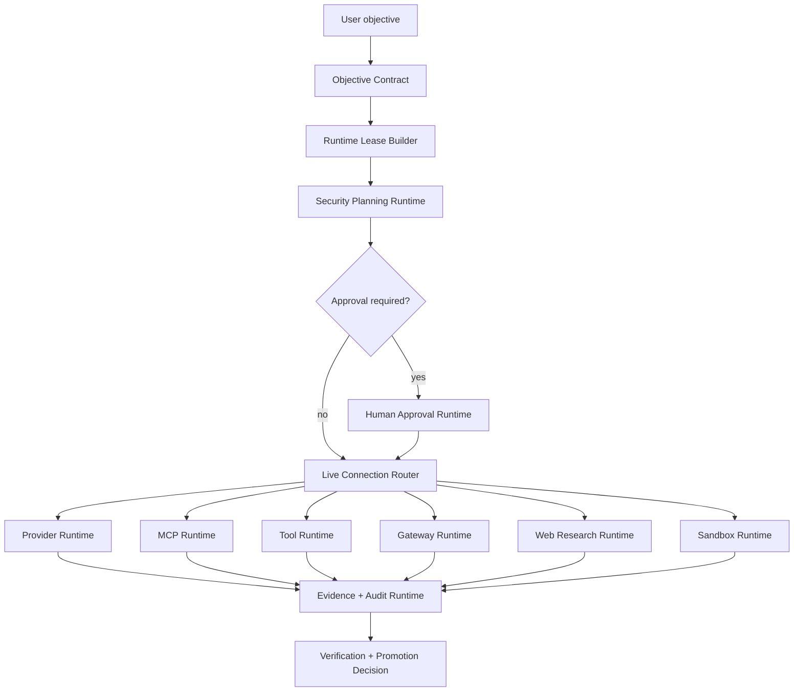

# Live Connection Architecture

This document defines the target architecture for wiring real external AI APIs,
MCP servers, tools, gateway delivery, web research, browser or terminal
automation, and remote sandboxes into Zeus.

`v0.8.0` does not claim these live integrations are production-active. It
establishes the public Platform Surface release gate and the dry-run contract
slice those integrations must pass through before live execution is enabled.

## Design Goal

Zeus should be usable as a broad Hermes-like agent platform while keeping its
own center of gravity: objective contracts, authority, leases, approval,
sandboxing, evidence, and controlled promotion.

The product-domain layer uses the reduced Zeus core language: Zeus Kernel,
Athena, Thunderbolt, Aegis, Mercury, Apollo, Hephaestus, Poseidon, Artemis,
Demeter, Olympus, and Prometheus. The technical runtime identifiers are
preserved, and product-domain labels do not rename runtime modules. Hermes
remains upstream/reference only. Mercury is the Zeus internal transport product name
for transport, connector, MCP, API, and gateway routing. Live connection
work in this document remains designed/prepared/dry-run/future until a later
implementation proves active execution through authority, leases, approval,
sandboxing, evidence, and promotion.

A live connection is allowed only when Zeus can answer these questions:

- Which objective requires this live surface?
- Which principal, session, subagent, or gateway client is asking?
- Which provider, MCP server, tool, network host, credential scope, path, and
  budget are leased?
- Which action needs human approval?
- Which sandbox can contain the side effect?
- Which evidence proves the action happened safely and helped the objective?
- Which rollback or revocation path exists if the connection misbehaves?

## Target Layering

The agent loop requests work. It does not own live authority. The live router
must receive a valid runtime lease, approval receipt when needed, and a sandbox
policy before dispatching a handler.

## Runtime Components

| Component | Responsibility | Current Zeus anchor |
| --- | --- | --- |
| `objective_runtime` | Defines accepted objective, constraints, deliverables, and verification obligations | `src/zeus_agent/objective_runtime/` |
| `runtime_lease` | Binds live capability, credential scope, network host, budget, TTL, and evidence target | `src/zeus_agent/runtime_lease/` |
| `security_runtime` | Decides allowed/blocked/dry-run before handler execution | `src/zeus_agent/security/planning.py` |
| `provider_runtime` | Resolves local LLM, fake, OpenAI-compatible, Anthropic-style, and future provider adapters | `src/zeus_agent/model_runtime/` |
| `mcp_runtime` | Registers trusted MCP servers, tools, schemas, resources, and credential scopes | future live module, dry-run surfaced through `src/zeus_agent/tool_limbs_runtime/` |
| `tool_runtime` | Filters visible tools, validates schema, blocks side effects without authority | `src/zeus_agent/tool_runtime/` and `src/zeus_agent/tool_limbs_runtime/` |
| `gateway_runtime` | Drafts and delivers external messages only through scoped targets and audit records | `src/zeus_agent/gateway_runtime/` |
| `research_runtime` | Builds source-pinned research evidence from web, GitHub, docs, and local sources | `src/zeus_agent/research_runtime/` |
| `sandbox_runtime` | Contains terminal, browser, file, remote, and network side effects | `src/zeus_agent/capability_runtime/` |
| `orchestration_runtime` | Schedules parallel agents and tasks with write-scope, dependency, and evidence checks | `src/zeus_agent/orchestration_runtime/` |
| `verification_runtime` | Validates artifacts, requirements, evidence, and no-secret-echo before completion | `src/zeus_agent/verification_runtime/` |
| `skill_evolution` | Proposes improvements without self-promoting authority | `src/zeus_agent/skill_evolution/` |

## Live Connection Flow

1. Compile the user goal into an objective contract.
2. Select required live surfaces: provider, MCP, web, tool, gateway, terminal,
   browser, remote sandbox, or scheduled workflow.
3. Build a runtime lease with:
   - principal and run id;
   - allowed capabilities;
   - credential scopes;
   - network hosts;
   - path or mount grants;
   - budget and TTL;
   - evidence target;
   - dry-run/live flag.
4. Run security planning before handler construction.
5. Request human approval when the action is destructive, credential-bearing,
   externally delivered, networked, plugin-loading, or sandbox-escaping.
6. Dispatch through the live connection router only after lease and approval
   checks pass.
7. Execute inside the narrowest available sandbox.
8. Capture evidence and audit records.
9. Verify the evidence against the objective.
10. Promote, continue, or block.

## Provider And AI API Connections

Provider adapters should be registered, not hard-coded into the agent loop.

Required contract:

- provider id and model id;
- endpoint and network host binding;
- credential scope reference, not raw secret;
- request budget;
- retry and timeout policy;
- no-secret-echo guarantee;
- structured response envelope;
- evidence record containing provider id, model id, latency, token estimate,
  decision, and redacted failure reason.

Default behavior:

- fake/local deterministic provider for tests;
- dry-run for unleased external providers;
- fail-closed when a requested provider, host, credential scope, or budget is
  outside the runtime lease.

## MCP Connections

MCP servers expand tool surface quickly, so Zeus should treat each server as a
supply-chain and authority boundary.

Required contract:

- server provenance: local path, package, git source, digest, or signed manifest;
- include/exclude tool allowlist;
- credential scope per server;
- prompt/resource exposure policy;
- schema redaction;
- tool description prompt-injection scan;
- per-tool side-effect classification;
- approval rule for destructive or external actions.

Default behavior:

- server resources and prompts are off unless explicitly enabled;
- tool descriptions are not blindly trusted;
- untrusted MCP servers are quarantined;
- tools with missing schema, unknown side effects, or unleased credentials are
  hidden from the model.

## Web And Research Connections

Zeus should support live web research, GitHub search, package docs, developer
community search, and source synthesis. The research result must become a
source-pinned graph, not loose text.

Required contract:

- source URL or local path;
- source type;
- captured timestamp or commit SHA;
- trust level;
- provenance id;
- summary;
- no-secret-echo check;
- citation/evidence link to the objective.

Default behavior:

- live web is disabled without network lease;
- unpinned external claims are blocked;
- stale source pins can be used for planning but not for high-risk completion
  claims without refresh;
- generated workflow ideas must be validated in sandbox before promotion.

## Sandbox And Tool Execution

Terminal, browser, file mutation, Docker, SSH, and remote execution must go
through a sandbox policy.

Required contract:

- execution backend: local, Docker, remote, browser, terminal, or no-op dry-run;
- allowed mounts and path grants;
- network egress allowlist;
- process and resource limits;
- no-new-privileges flag when available;
- blocked host resources such as Docker socket unless explicitly justified;
- cleanup receipt;
- evidence artifact path.

Default behavior:

- network egress is deny by default;
- host filesystem mounts are deny by default;
- destructive commands require approval;
- handler output cannot declare completion without verification evidence.

## Parallel Orchestration

Live work can be parallelized, but parallelism must be governed.

The scheduler must block:

- cycles;
- missing evidence targets;
- subagent depth greater than one unless explicitly allowed;
- unleased live-capable tasks;
- overlapping independent write scopes;
- budgetless or TTL-less standing work;
- recursive automations that can escalate authority.

Parallel work should be grouped only when tasks have disjoint write scopes or a
clear dependency order.

## Security Gates

Every live connection type should pass these gates:

| Gate | Blocks |
| --- | --- |
| Threat model gate | New live provider, MCP server, gateway, plugin, sandbox, or connector without attack-surface record |
| Lease scope gate | Missing capability, path, network host, credential, TTL, budget, or evidence target |
| Approval gate | Destructive, credentialed, external delivery, plugin load, or privileged sandbox action without receipt |
| Secret echo gate | Raw secret in prompt, schema, evidence, log, result, memory, or source pin |
| MCP surface gate | Tool sprawl, untrusted server, prompt-injection markers, unredacted schema |
| Gateway exposure gate | Non-loopback bind, missing auth, missing pairing, unscoped delivery target |
| Sandbox egress gate | Open network, unsafe mounts, host socket, missing process/resource limits |
| Automation gate | Cron/headless work that bypasses approval or authority |
| Review gate | Live integration shipped without independent security/runtime review |

## v0.8.0 Implementation Boundary

`v0.8.0` includes:

- deterministic total architecture CLI/eval surfaces;
- release-gated ULW status for the v0.6.0 -> v1.0.0-rc program;
- provider and MCP loopback readiness as part of the live-spine checkpoint;
- Tool Limbs reporting for native tool catalog visibility, MCP discovery
  contract availability, API connector contract availability, include/exclude
  policy, approval lease, security gate, evidence capture, and no-secret-echo
  checks;
- Platform Surface reporting for CLI, API, gateway, ACP, batch, and Python
  library entrypoints with loopback default posture, non-loopback review,
  auth/pairing/allowlist posture, approval lease, security gate, evidence
  capture, and no live handler execution;
- security planning for live-capable surfaces;
- runtime lease scope checks;
- research evidence graph contracts;
- ontology candidate contracts;
- sandbox workflow optimization hints;
- dry-run parallel scheduler contracts;
- stabilized Zeus Core Language mapped to technical runtime anchors;
- public design for live connections.

`v0.8.0` does not include:

- production live MCP catalog;
- long-running gateway daemon;
- hosted API server;
- unattended browser or terminal execution;
- remote sandbox isolation;
- automatic credential vault integration;
- production web search provider selection.

## Implementation Roadmap

1. Add a `live_connection_runtime` router that accepts objective contract,
   runtime lease, approval receipt, sandbox policy, and request envelope.
2. Add provider registry adapters for OpenAI-compatible APIs, Anthropic-style
   APIs, local LLM servers, and fake deterministic providers.
3. Add MCP server registry with manifest provenance, tool allowlists, and
   schema/description scanning.
4. Add web research connectors that emit `ResearchEvidenceGraph` nodes with
   source pins.
5. Add sandbox policy adapters for local no-op, subprocess dry-run, Docker,
   browser, and remote execution.
6. Add approval receipt storage and audit records.
7. Add eval scenarios for live-disabled, dry-run, approved-live, credential
   mismatch, egress block, plugin quarantine, and gateway target block.
8. Add production readiness gates before enabling unattended live operation.
